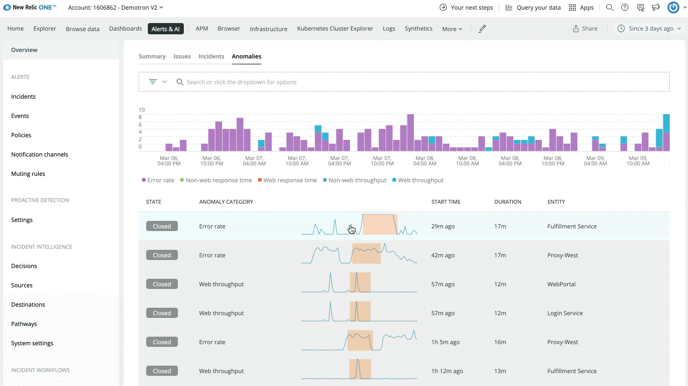
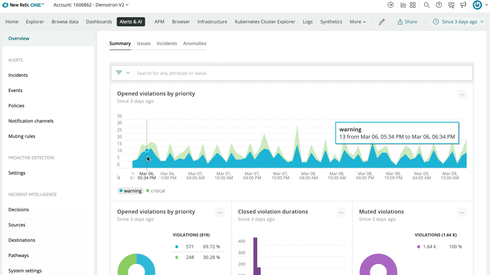

Improve your incident response. These features help you detect problems before they become issues or worse. 

## Free automatic proactive anomaly detection

Applied Intelligence automatically spots anomalies based on golden signals like throughput, errors, and latency across all applications and services—and it’s now automatically enabled for all your instrumented apps and services without configuration, and at no additional cost. With a [real-time feed](https://one.nr/01qwL999rR5) of every anomaly and in-depth analytics, you can create dashboards and query your anomaly data and even integrate it with Incident Intelligence. Click on any anomaly to bring up an automatic analysis of likely causes and see related signals for upstream and downstream services. Get notified in your collaboration tool of choice, like Slack so you can troubleshoot faster and prevent potential problems from impacting customers.

Anomalies are automatically surfaced in the Applied Intelligence anomalies feed and activity streams throughout New Relic One. 

## Find anomalies in logs with Log Patterns 

We now offer a new capability that uses machine learning to automatically cluster, detect patterns, and surface outliers in your log data, so you can explore millions of log messages in a single click and reduce your manual troubleshooting time. Log Patterns is currently in public beta—if you’d like to turn it on for your New Relic account, reach out to your customer success manager. 

## Investigate alerts analytics

A [new integrated landing page](https://one.nr/0X8woKKdqwx) highlights insights and analytics about how your alert configurations are performing.

