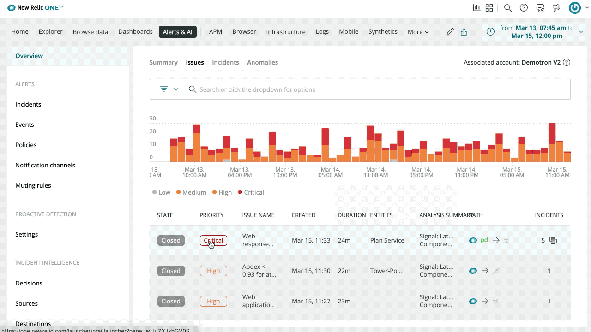
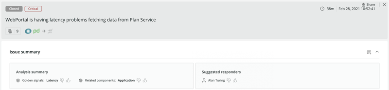

## See the probable root cause(s) of every issue

Applied Intelligence gives you automatic insights into the probable root cause of every issue. You can quickly see why each open issue occured, which deployments contributed, relevant error logs and attributes, and an opinionated probable cause to help you investigate the problem faster than ever. Applied Intelligence scans the distribution of every single attribute within event data ingested, and surfaces possible causes by finding significant changes in the distribution. For example, for every single transaction event generated, we can scan to see if a single user starts to take up an unusual share of the requests sent to your app.

In addition, root cause analysis automatically classifies issues based on golden signals like errors, traffic, latency, and saturation so you can quickly orient yourself to why the problem occurred.

<iframe width="560" height="315" src="https://www.youtube.com/embed/Dcv8au2exWg" frameborder="0" allow="accelerometer; autoplay; clipboard-write; encrypted-media; gyroscope; picture-in-picture" allowfullscreen></iframe>

Also, learn more about root cause analysis straight from our product team [here](https://youtu.be/xEJdsYWKjuw). 

## Understand the impact and scope of every issue

You can see which entities (hosts, containers, applications) are affected to quickly and accurately assess scope and determine what needs to be remediated. You can isolate the source of the problem with automatic insight into how services and components of your environment are impacted by every issue. 

## Two-way integration with ServiceNow for correlated issues

Adding to our existing two-way integration with PagerDuty, you can now eliminate the toil of managing incidents across tools by syncing the state of correlated issues in Applied Intelligence with ServiceNow incidents bi-directionally. As the state of correlated issues changes in either platform, it is now automatically updated in both tools. Applied Intelligence also supports a webhook for integrating with VictorOps, OpsGenie and other tools of your choice.

Learn more about two-way integration with ServiceNow straight from our product team [here](https://youtu.be/29Ms4wfziB8). 

## Suggested responders for New Relic Alert violations

Get [automatic recommendations](https://docs.newrelic.com/docs/alerts-applied-intelligence/applied-intelligence/incident-intelligence/get-started-incident-intelligence/#suggested-responders) for individuals on your team who are best equipped to respond to an issue, either because they are experts in the component failing or have resolved similar issues before. This enhancement builds on our existing support for suggesting responders based on PagerDuty incident data, by suggesting responders for issues that originate from New Relic Alert violations. Best of all, this feature is completely automatic and requires no configuration or model training—it just works out of the box as New Relic learns from the behaviors of responders on your team.

