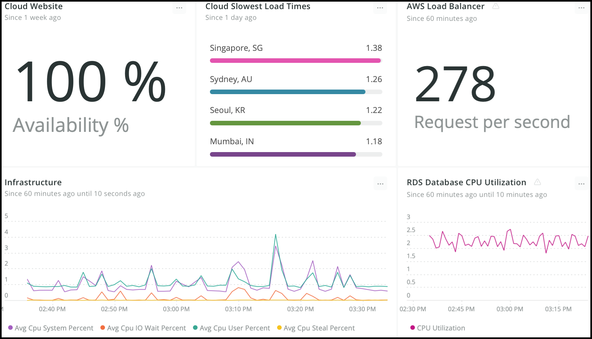
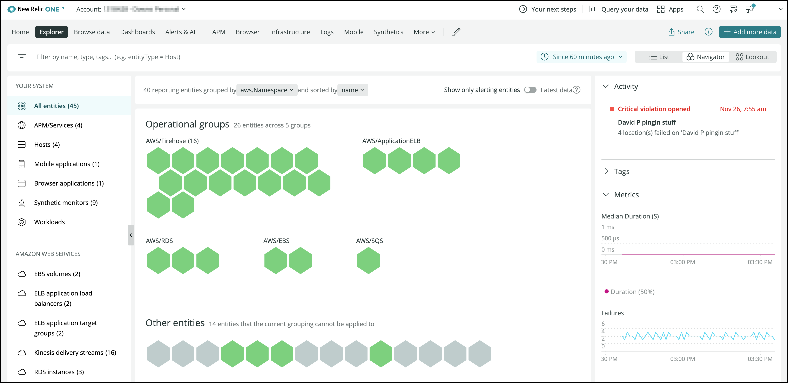
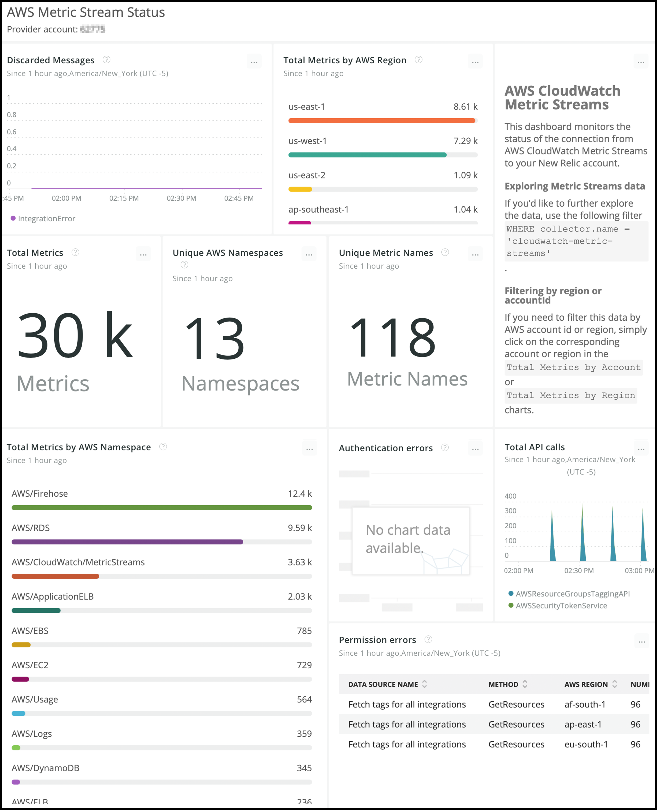

## More metrics, more often - fill gaps in your observability with Amazon CloudWatch Metric Streams and New Relic One

More metrics more often means that you’ll receive Amazon CloudWatch data from all the AWS services you use as soon as they are available. Keep your applications running in the AWS Cloud humming. Less delay equals faster decisions. Correlate, analyze, visualize, and alert on the Amazon CloudWatch metrics for all of the AWS services your AWS cloud-based applications use.

Two integration modes are available when you create a new AWS integration.

Once you’ve completed setup, you can bring the data from AWS into dashboards right alongside the other New Relic One data available to you. The example below shows metrics from New Relic One’s Synthetic and Infrastructure Monitoring right next to the AWS Application Load Balancer and RDS database Metric Streams data.

The Metric Streams data is stored in New Relic One’s [Telemetry Data Platform](https://docs.newrelic.com/docs/telemetry-data-platform/) as [dimensional metrics](https://docs.newrelic.com/docs/telemetry-data-platform/ingest-manage-data/understand-data/metric-data-type) of the summary type and can be queried using NRQL and used in [Navigator](https://blog.newrelic.com/product-news/nerdlog-new-relic-navigator/) and Lookout.

This is the Navigator view grouped by AWS namespaces.

Below is the Amazon CloudWatch Metric Streams status dashboard from Infrastructure -> AWS -> Account status dashboard

Check out this short video walking through Amazon CloudWatch Metric Streams benefits.

<iframe width="560" height="315" src="https://newrelic.wistia.com/medias/8xv3zzyfxe" frameborder="0" allow="accelerometer; autoplay; clipboard-write; encrypted-media; gyroscope; picture-in-picture" allowfullscreen></iframe>

To get started:

1. Navigate to Infrastructure
2. Click AWS to set up your AWS integration today