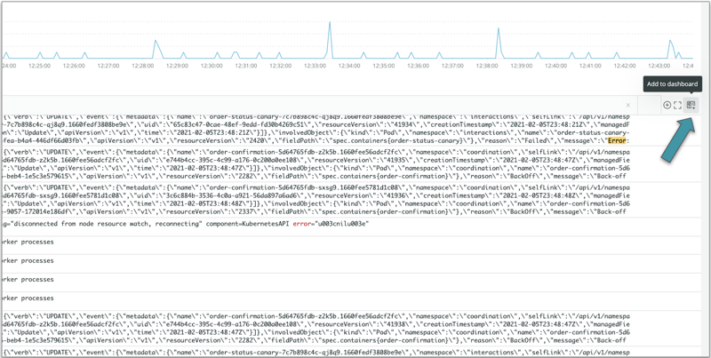
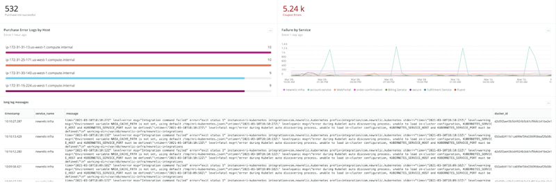

Log messages are unique in their patterns and length, and we leveraged a new custom visualization feature to create an easy way to add log messages to your dashboards. Using this new feature, long log messages with lots of attributes can wrap, and columns can easily be resized. To use this feature just click on the icon in the top right of the of the log messages panel.

Combine your log messages with the rest of your Telemetry data already living in New Relic One. Want to know how to turn on logs to improve the scope and granularity of insight into your full stack? You can [get started](https://one.nr/037jbG3Z7Qy) right now!

Check out the latest Nerdlog episode to learn more about the improvements we've made to the logs user experience: 

<iframe width="560" height="315" src="https://www.youtube.com/embed/pTakNUihv6w" title="YouTube video player" frameborder="0" allow="accelerometer; autoplay; clipboard-write; encrypted-media; gyroscope; picture-in-picture" allowfullscreen></iframe>
