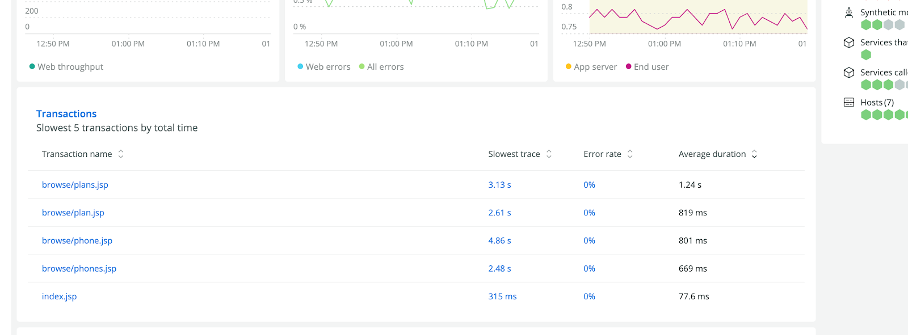

With the slow transactions list, you can jump to a complete slow trace of one of your top five most time-consuming transactions with one click from the **Summary** page. You can also, for the first time, see the error rates for those transactions, to instantly identify which code path is responsible for an increase in errors.

“Most time-consuming” means the transactions that your service is spending the most total time processing, expressed as throughput multiplied by average response time.

As with other charts on the **Summary**, you can filter the slow transactions list to different types of transactions (web, non-web, and so on), or to transactions served by a particular instance of your service, using the filter controls at the top of the page.

The slow transactions list is available today for services instrumented with the New Relic agent.