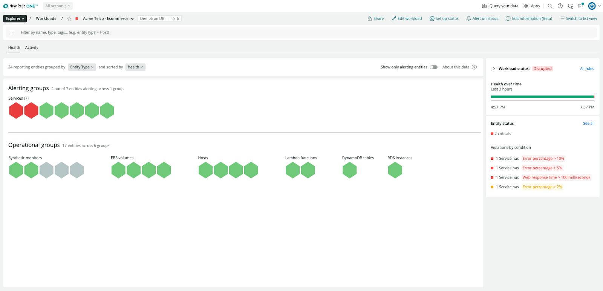
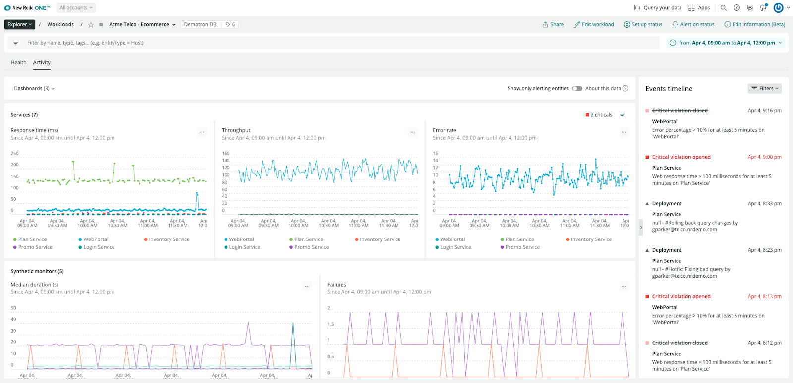
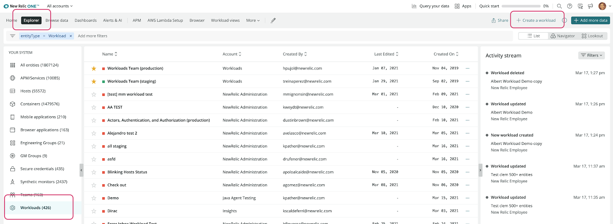

With Workloads, you can group all the entities that make up your complex system into views that make sense to your team. 

You don’t need to navigate through all the telemetry that you send to New Relic: your workloads will give you a quick snapshot of how the systems that you and your team are accountable for are doing. And once you have the high level notion of how your system is doing and you need more details, you’ll be able to quickly navigate to other areas in New Relic One.

We’ve released the new Health and Activity views that make it easier to understand the current status of the workload entities, and relate their golden metrics to the latest events such as deployments or incidents.

## The Health tab

The new Health tab shows how the global status of your workload changed in the last few hours, along with the current status of the workload entities. Use this view to understand if you need to take immediate action on any of the components that build your system.

Similar to the Navigator view that you can find on New Relic One Explorer, you’ll immediately see which entities are alerting, and will be able to filter and group them by health status, entity type or tag key. When something’s failing, you’ll immediately spot which entities in your system you need to have a look at first. 

The Health tab also compiles all the open violations that affect your workload, with a preview of the conditions that are violated.

## The Activity tab

You’ll find the golden metrics of your workload in the Activity tab. These charts will surface trends, spikes and outliers among the entities that make part of your system.

And... don’t miss the new Activity stream! You’ll see all deployments, open incidents, anomalies and even workload configuration changes that can explain why you’re seeing changes in the golden metrics.

And if the charts get too messy, just use the filter bar to scope down the time series you’d like to focus on.

New Relic Workloads is available out-of-the-box to all Full-Stack Observability users, you can start creating them from the Explorer.

