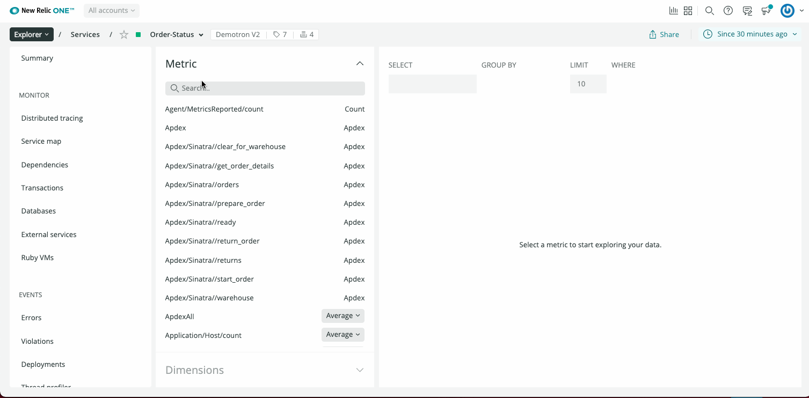

Now you can create an alert condition from just about anywhere in New Relic!  Well, anywhere where there is a New Relic One chart. 

1. Click on the ellipses icon in the upper right corner of a chart to reveal its action menu. There, you will see an option to **Create alert condition**. 
    * If the chart is displaying a single metric, a slide out window will appear to create a new alert condition, with the NRQL query pre-populated.
    * If the chart is displaying multiple queries, you will be asked to choose which query you wish to use.
2. Within the condition creation form, you can select an existing policy, or create a new one.
3. Then, get right back to your investigation.

Creating an APM alert condition

Improved alert condition creation from logs and serverless experiences 
