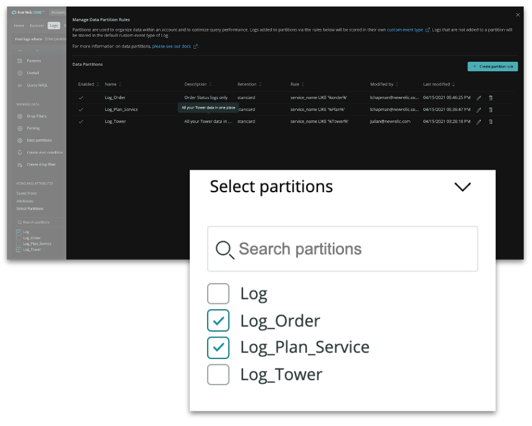

Although we’ve always provided the ability to segment data across accounts, our customers wanted to have more granular control to partition data within each account.  

With log partitions, administrators have complete control over how to segment log data within each account. Partitions empowers end users to optimize queries by searching within a single partition or select multiple partitions to find the detailed log messages they need. 

To learn more about how to leverage partitions for log data in your organization view our online documentation [here](https://docs.newrelic.com/docs/logs/log-management/ui-data/data-partitions/).

Watch the Nerdlog segment segment below to learn more:

<iframe width="560" height="315" src="https://www.youtube.com/embed/uH8zRmCxPqo" title="YouTube video player" frameborder="0" allow="accelerometer; autoplay; clipboard-write; encrypted-media; gyroscope; picture-in-picture" allowfullscreen></iframe> 
