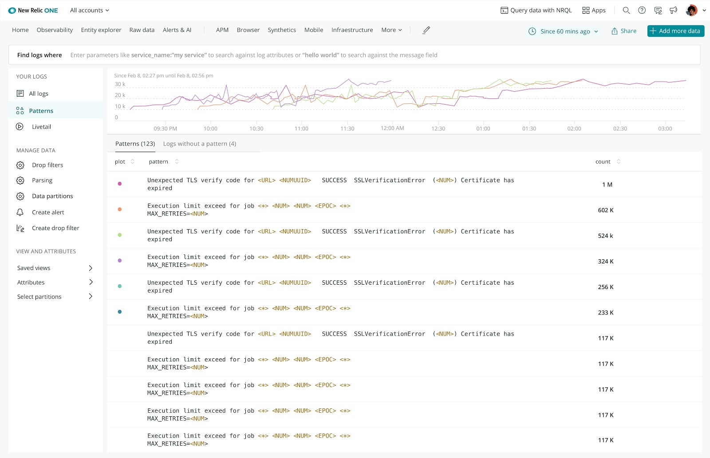

Reduce troubleshooting time with machine learning to automatically detect patterns that are clustered to surface outliers in log data. 

Now, you can quickly find the patterns and use them to create queries, alerts and dashboards. This feature is generally available in beta, and you can easily opt in by contacting your account manager to experience how this innovation can serve your business needs on your own data. In the next few weeks a new option will be provided to turn on/off this feature directly in the UI.

To learn more about how to leverage patterns for logs in New Relic, head to our docs by clicking **Learn More** above, or to check it out for yourself in New Relic One, click **Get Started** above.

Check out the Nerdlog segment to learn more about detecting patterns and outliers in log data:

<iframe width="560" height="315" src="https://www.youtube.com/embed/JtgSrB5J0_w" title="YouTube video player" frameborder="0" allow="accelerometer; autoplay; clipboard-write; encrypted-media; gyroscope; picture-in-picture" allowfullscreen></iframe>
