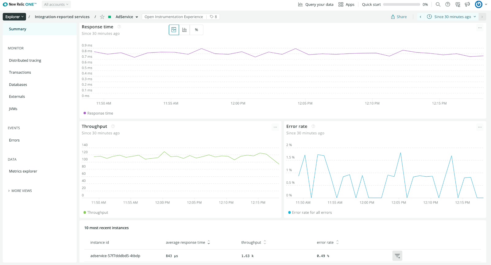

New Relic is excited to announce the availability of native OpenTelemetry Protocol (OTLP) data ingestion as a pre-release program! [OTLP](https://github.com/open-telemetry/opentelemetry-specification/blob/main/specification/protocol/otlp.md) is an open source gRPC based protocol for sending telemetry data. The protocol is vendor agnostic and open source.

You can now send traces, metrics, and logs directly to New Relic via the open source OpenTelemetry protocol and utilize the out-of-the-box user experiences to quickly discover the data you need to root-cause and optimize the performance of your applications and services.

