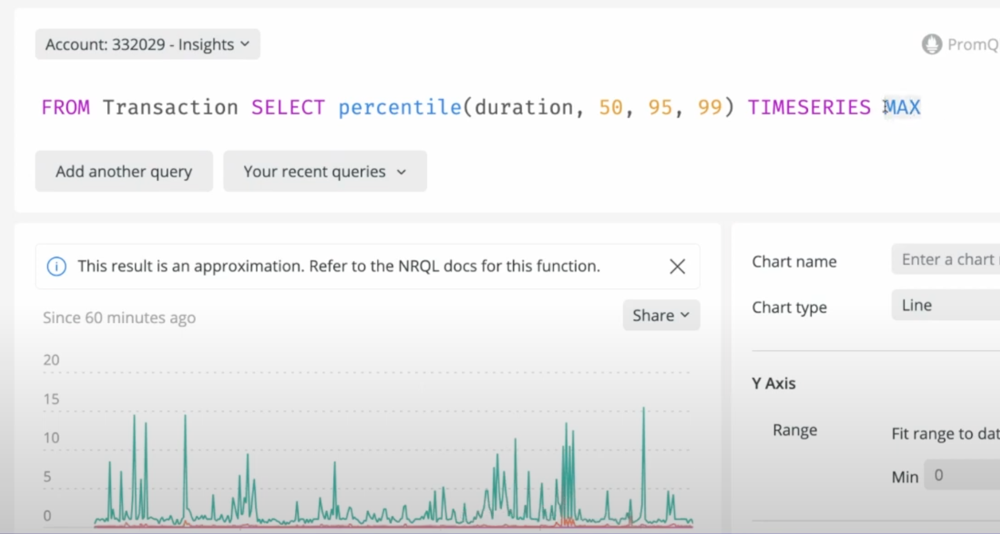
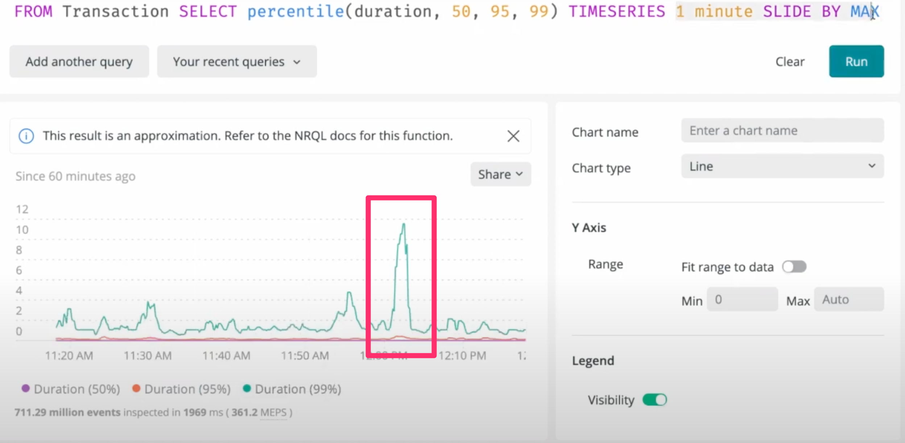

​
​
# Filter your queries with Regex
​
It’s great how NRQL lets you use `OR` statements to combine multiple results. But this has some natural limitations: trying to match all strings that start with letters rather than numbers would take a lot of `OR` statements.
​
But now, you can use `RLIKE` to use a regular expression for filtering. A query like:
​
`SELECT count(*) FROM Transaction WHERE hostname RLIKE 'ip-10-351-[0-2]?[0-9]-.*'`
​
lets you tightly control the IPs that match your query. There are some limitations on the complexity of your regex, but if you want to do queries with character ranges, you should be able to do all you need.
​
​
# Smooth, accurate charts with sliding time windows
​
‘Sliding time windows’ sounds a bit like a magical patio door. But it refers to an ability to smooth charts for clearer signaling. Using a sliding time window, a set of small, high spikes will tend to group up into one, more visible spike.

​
Adding the `SLIDE BY` clause will let each data point contain average data about its neighbors:
​
`SELECT average(duration) from Transaction TIMESERIES 5 minutes SLIDE BY 1 minute`

The documentation [illustrates how these queries work ](https://docs.newrelic.com/docs/query-your-data/nrql-new-relic-query-language/nrql-query-tutorials/create-smoother-charts-sliding-windows/)and how you can use them today.
​
​
# Nested queries let you simplify further
​
When you want to reduce cardinality by more than one degree, for example, when you want to see results averaged across time when you have a time x quantity chart, you can now nest your queries to let you further simplify your data.
​
To see a good example of this, [watch the last episode of the Nerdlog.](https://www.youtube.com/watch?v=0SzBLDqqx1k)