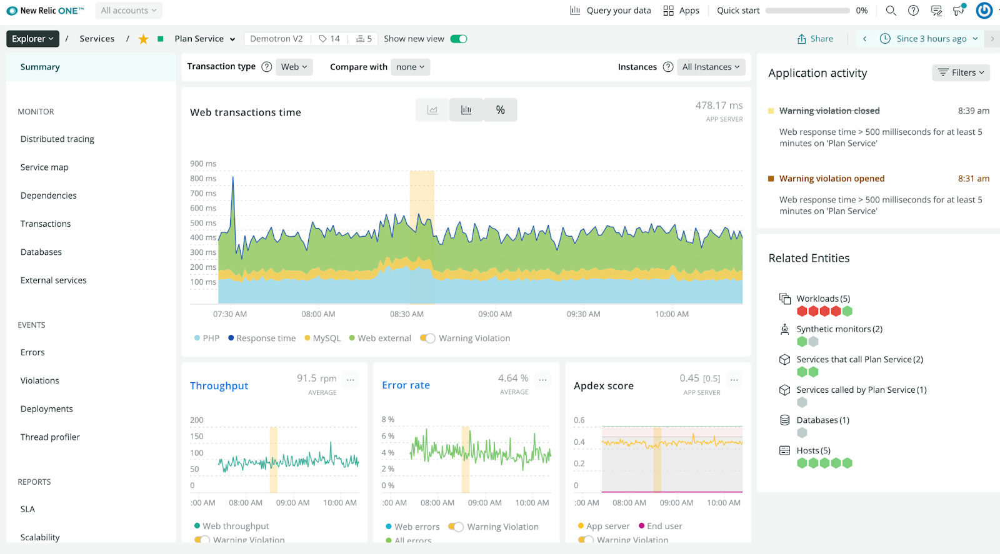

With the release of PHP agent v9.17.0, we have included the eagerly anticipated support for PHP version 8.0! This is primarily for 64-bit environments with the Just In Time (JIT) compilation disabled. 

