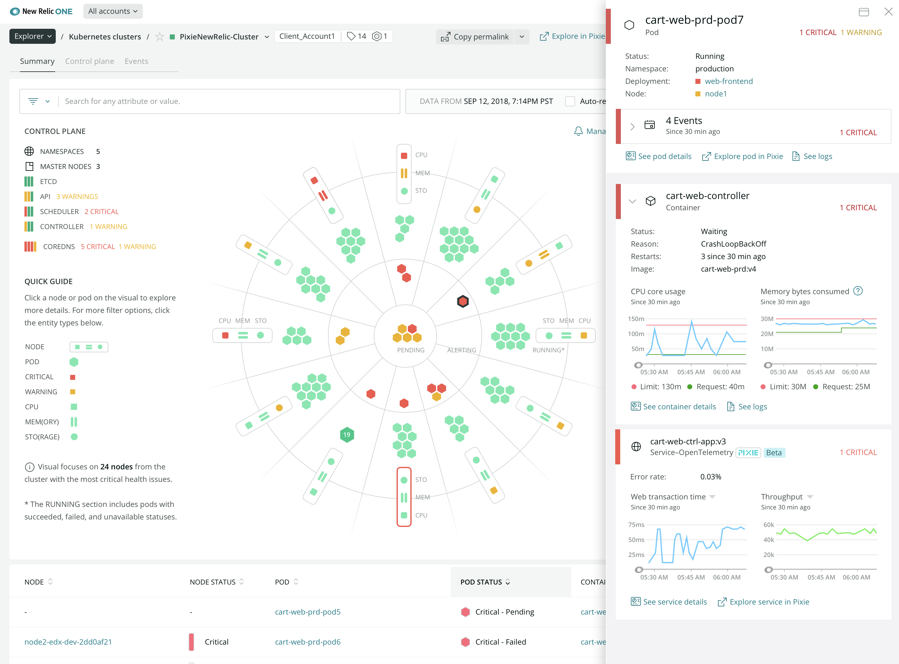

We've removed the largest barriers to Kubernetes observability: The time and expertise required to manually instrument application code, by integrating Pixie Auto-Telemetry into our Kubernetes solution. Now, you can get visibility into your Kubernetes clusters and workloads instantly without installing language agents. 

Pixie data helps you debug faster than ever before, giving you access to everything on-cluster without sampling, then using AI/ML models to send the most relevant subset of your data to the Telemetry Data Platform for correlation with other services, intelligent alerting, and long term storage. Pixie Auto-Telemetry uses eBPF to automatically collect metrics, events, logs, and traces for your Kubernetes clusters, applications, OS, and network layers.

* **Start fast:** No code to update, new deployments, or lengthy monitoring standardization processes.
* **Observe everything:** Analyze data on-cluster using AI/ML without sampling, storing high-value telemetry data for alerting, correlation, and long term storage.
* **Debug faster** with Pixie’s developer-focused workflows, providing code-level insights.

## Get started today
1. In New Relic One, choose **Add more data.**
2. Choose [**Guided install**](https://one.newrelic.com/launcher/nr1-core.home?pane=eyJuZXJkbGV0SWQiOiJucjEtY29yZS5ob21lLXNjcmVlbiJ9&cards%5B0%5D=eyJuZXJkbGV0SWQiOiJucjEtaW5zdGFsbC1uZXdyZWxpYy5ucjEtaW5zdGFsbC1uZXdyZWxpYyIsImFjdGlvbkluZGV4IjoxfQ==) or [**EU Guided install.**](https://one.eu.newrelic.com/launcher/nr1-core.home?pane=eyJuZXJkbGV0SWQiOiJucjEtY29yZS5ob21lLXNjcmVlbiJ9&cards%5B0%5D=eyJuZXJkbGV0SWQiOiJucjEtaW5zdGFsbC1uZXdyZWxpYy5ucjEtaW5zdGFsbC1uZXdyZWxpYyIsImFjdGlvbkluZGV4IjoxfQ==)
3. Choose **Kubernetes**, and then follow the on-screen prompts.

