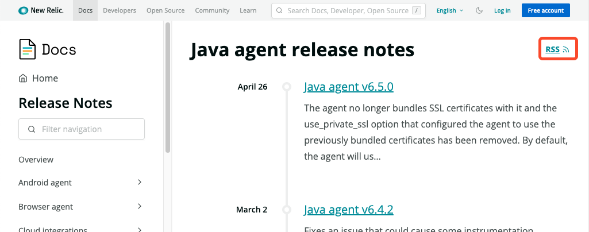
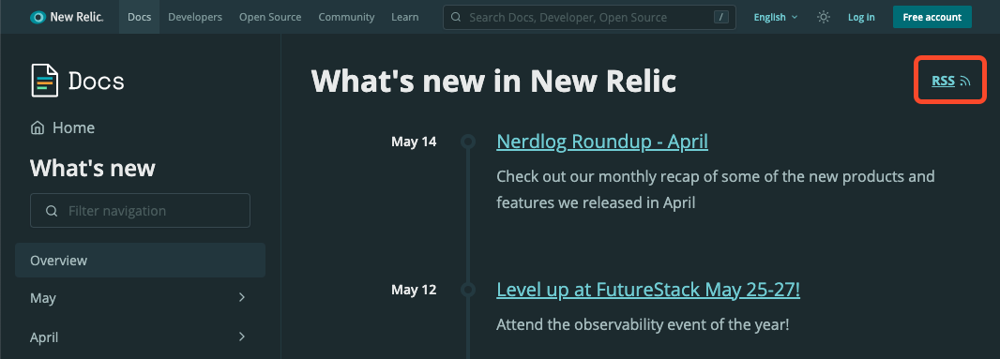

Have you heard? RSS is back! And we're on board. We've long had release note feeds for agents and downloadable software from the [release notes](https://docs.newrelic.com/docs/release-notes/) page.



Lately, we've seen lots of requests to add RSS for What's New and our security bulletins, so we've done just that! Now you can subscribe to all the newness New Relic has to offer.

You can plug those feeds into your feed reader, of course, but you can also automatically post to a channel with [Slack's built in RSS app](https://slack.com/help/articles/218688467-Add-RSS-feeds-to-Slack) or Microsoft Team's RSS app. Or go crazy with IFTTT or Zapier for all manner of RSS-based automation. (Want to create a Zapier workflow that turns your smart lightbulbs green every time we release a new Node.js agent? Go for it!)



We also release weekly [Nerdlog](https://developer.newrelic.com/nerdlog/) episodes on [YouTube](https://www.youtube.com/watch?v=Opq3a22xnFw&list=PLmhYj7Jl81JGOEHV7zUVfa_iGNyOfMGNh) (in case you miss our interactive livestream every Thursday at 12 p.m. PT on Twitch) to ensure you know about the latest products and features directly from the product managers and engineers at New Relic who built them, and [Nerd Bytes](https://developer.newrelic.com/nerd-bytes/) episodes on [YouTube](https://www.youtube.com/playlist?list=PLmhYj7Jl81JEV-llIDkCVC05tD7fbOv_b) for quick tips, tricks, and ideas about New Relic and observability. We've got RSS for those too!

## Get a link to the feeds

* What's New:
    ```
    https://docs.newrelic.com/whats-new/feed.xml
    ```
    Or find the feed from the **RSS** icon on [What's New](https://docs.newrelic.com/whats-new/).
    
* Security bulletins:
    ```
    https://docs.newrelic.com/docs/security/new-relic-security/security-bulletins/feed.xml
    ```
    Or find the feed from the **RSS** link on the [security bulletins](https://docs.newrelic.com/docs/security/security-privacy/information-security/security-bulletins/) page.
    
* Nerdlog:
    ```
    https://www.youtube.com/feeds/videos.xml?playlist_id=PLmhYj7Jl81JGOEHV7zUVfa_iGNyOfMGNh
    ```

* Nerd Bytes:
    ```
    https://www.youtube.com/feeds/videos.xml?playlist_id=PLmhYj7Jl81JEV-llIDkCVC05tD7fbOv_b
    ```
* Agents:
    We've got too many agents to list all the links! You can find a link by picking your agent from the [release notes](https://docs.newrelic.com/docs/release-notes/) page and then clicking the **RSS** icon.
