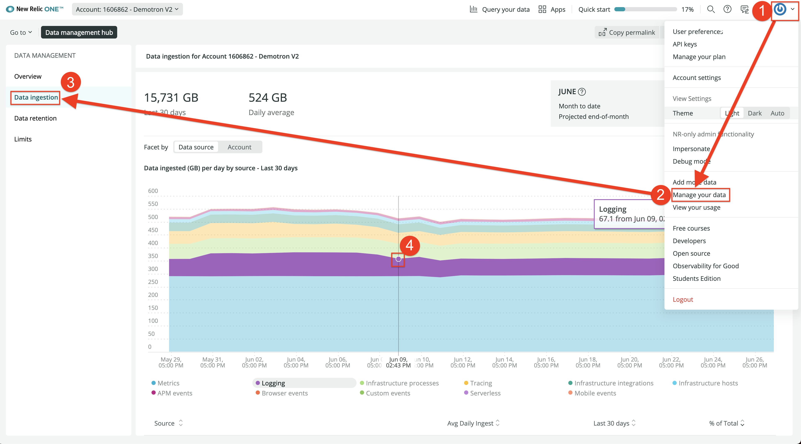
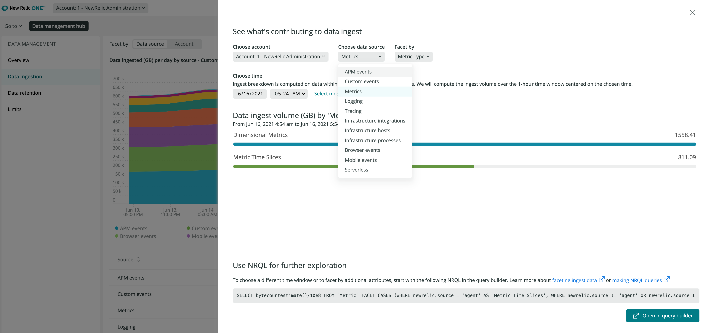

Inspect your data consumption in New Relic to better manage your data ingest and costs. Understand your data usage by each data source, and analyze it using your existing metadata, such as by source, team, and any other data sample attribute.

To get started, go to the **Data management hub** and select the **Data ingestion chart**. Get detailed insights by data source by clicking on the colored data band at any point in time that you’re interested in. Add "facets" to analyze your data by selected attributes. [**Learn more**](https://docs.newrelic.com/docs/telemetry-data-platform/manage-data/manage-data-coming-new-relic/#facet-data-ingest) and [**get started**](https://one.newrelic.com/-/0gbRKzygzwE).

<figcaption>To find your data ingest consumption, click Manage your data, then click Data ingestion.</figcaption>

<figcaption>Click the chart to see ingestion by data source.</figcaption>
