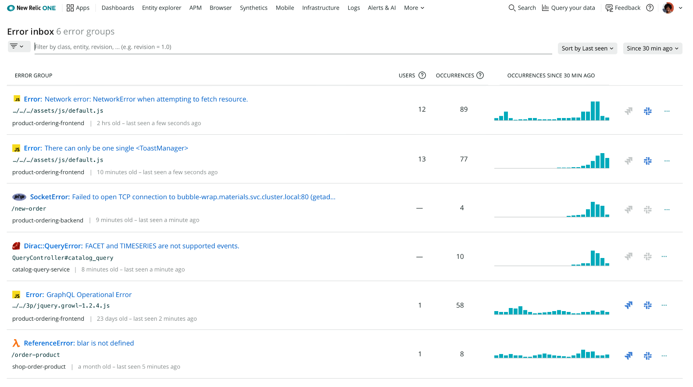

Recently, we launched New Relic Errors Inbox, an error tracking solution that provides you a single place to view, triage and resolve errors across your full application stack. This exciting feature now includes Logs in Context and an integration with Slack.

Read more about the latest updates in our [blog post](https://newrelic.com/blog/how-to-relic/error-tracking-with-errors-inbox) and watch a demo in the latest Nerdlog episode [here](https://youtu.be/3LoIG5I75-Y).

**What’s Included with New Relic Errors Inbox:**

- **Errors Inbox.** Errors are grouped and displayed on a single screen for visibility and easy triaging. Filter to just the applications and services that you care about.
- **Rich Error Details.** Resolve errors faster with context of the full stack, including APM, Browser (RUM), Mobile, and Serverless (AWS Lambda Function) data. Error data persists to provide continued context for recurring errors.
- **Log Data.** Logs in Context are provided alongside other error data right in the error group details for even more information to resolve errors faster.
- **Cross Team Collaboration.** Work errors as a team with shared error visibility, shared comments, and an integration with Slack.

**Next Steps**

New Relic Errors Inbox is available to all New Relic Full-Stack Observability customers in the U.S. datacenter. To enable Errors Inbox, sign up for a [free account](https://newrelic.com/signup) or log in to your existing account and follow these steps:

1. From one.newrelic.com, select **More** in the top right and click Errors Inbox.
2. If this is your first time accessing Errors Inbox, you will be prompted to select a workload in the top left.

<iframe width="560" height="315" src="https://www.youtube.com/embed/6zRkpPTVjwc" frameborder="0" allow="accelerometer; autoplay; clipboard-write; encrypted-media; gyroscope; picture-in-picture" allowfullscreen></iframe>
