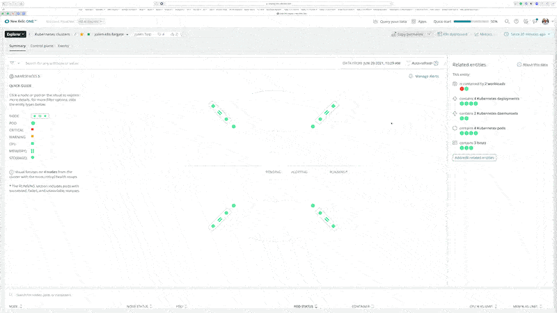

We are introducing New Relic's integration for Amazon EKS on AWS Fargate public beta. If you are interested in checking out the beta, please follow the steps found in the [documentation](https://docs.newrelic.com/docs/integrations/kubernetes-integration/installation/install-fargate-integration/).

Our EKS Fargate integration supports any Fargate setup, whether the cluster is only composed of Fargate nodes or if it also coexists with EC2 nodes.

The integration is also compatible with the New Relic One Kubernetes cluster explorer, providing a holistic view of a Kubernetes cluster and rapid troubleshooting.

We've also improved the Kubernetes dashboard to list Fargate nodes and distinguish between standard and Fargate serverless nodes.

**Check it out today.**
