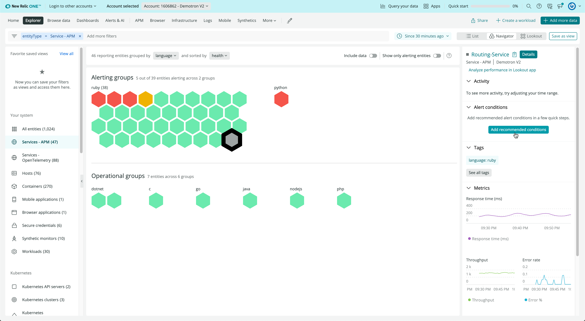
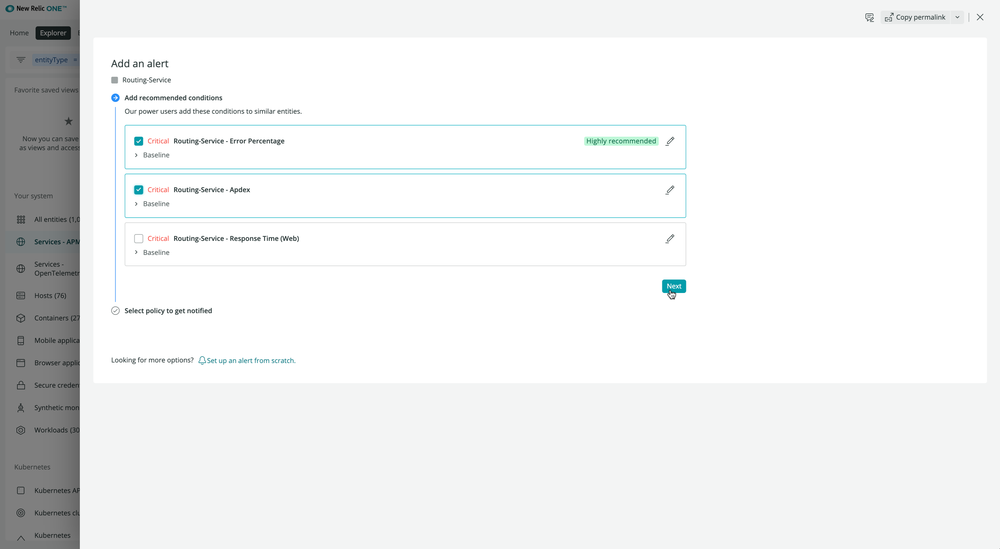

Configuring incident detection consistently across your entire estate helps you track the overall health of your systems, avoid blindspots, and reduce the time it takes to identify and resolve issues. 

We know that creating accurate alert conditions is anything but simple. Knowing which metrics to monitor, and setting the thresholds accordingly, is a task that few have the necessary knowledge of both their systems and of New Relic to feel confident executing. This results in teams only applying incident detection practices to a subset of critical services. 

Good news: New Relic One now has an alert condition recommendation service that uses AI and machine learning (ML) to recommend specific metrics and signals to monitor for your specific entities. You can use the provided recommendations or modify them to fit your specific needs.

Here’s how you can add recommended alerts to APM entities that do not currently have alert coverage.

 
## Using recommended conditions
Go to **Services - APM** in [New Relic Navigator](https://docs.newrelic.com/docs/new-relic-one/use-new-relic-one/core-concepts/new-relic-explorer-view-performance-across-apps-services-hosts/) and you’ll see a high-density view of the health of your system. With the traffic-light visual, it’s easy to view which entities are healthy, which entities have violations, and which entities do not have any alerts coverage. If an entity does not have alert coverage, its hexagon will be gray. Recommended conditions helps you automatically add alerts to entities that do not have alerts coverage, those gray hexagons.

1. **Select an entity:** Click an uncovered entity (gray hexagon). A new option will appear on the right-hand side of the screen. Click Create alert condition as shown in the image below.

2. **Choose a number of recommended conditions.** The recommendations will depend on the quality of the tags associated with an entity. The more accurate and informative the tags are, the more precise the recommendations will be. The image below shows a few possible recommendations based on error percentage, Apdex, and response time.

Learn more about recent innovations in alerting with our PM Brian Goleno [here!](https://www.youtube.com/watch?v=NV9ueK8JmRo&feature=youtu.be"). 

