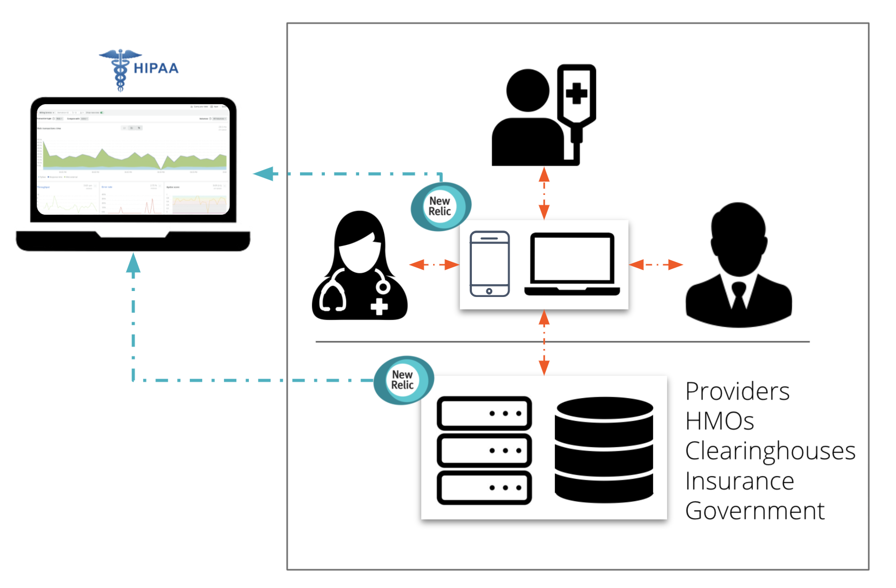

Today, we’re releasing our HIPAA-enabled observability platform for healthcare industry systems containing Protected Health Information (PHI). As a result, New Relic will now sign Business Associate Agreements (BAAs).

Covered entities including insurance companies, health maintenance organizations, government assistance programs, providers, and clearinghouses can now send application, infrastructure, digital experience, and network monitoring data to the Telemetry Data Platform while maintaining HIPAA compliance.

Our solution supports the following:
1. **Domains:** Infrastructure, applications, digital experience, and network
2. **Data types:** Metrics, events, logs, and traces
3. **Monitored environments:** On-premises and cloud

Learn more at [HIPAA enablement - what you need to know and do](https://docs.newrelic.com/docs/security/security-privacy/compliance/hipaa-readiness-new-relic/) and reach out to your account representative to get started.

