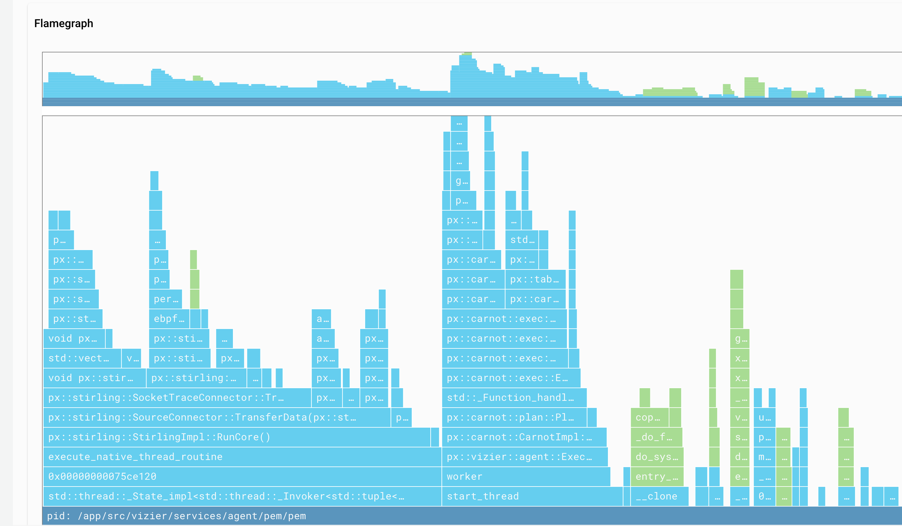

We’re excited to announce the GA release of Auto-telemetry with Pixie (at no additional cost). Pixie is a significant upgrade to our Kubernetes toolset, and it’s the only solution that (1) removes the monitoring gaps that naturally emerge in Kubernetes environments, and (2) provides code-level insights to developers in ways that legacy tools don’t.

## Debug faster with code-level insights for developers. 
Drill down into your services without modifying source code, and debug with service maps, flamegraphs, and raw requests.

1. Live debugging capabilities without sampling.
2. Real-time service, DNS, and network flow graphs to help understand intra-cluster communication and latency between components.
3. Flamegraphs to understand where code is running slowly or consuming valuable cluster resources.

## Instant, no-code observability
Auto-telemetry with Pixie means every service gets monitoring instantly, and because Pixie is language-agnostic, you don’t need instrumentation expertise. Pixie analyzes data on-cluster without sampling, sending high-value data to Telemetry Data Platform for alerting, correlation, and long-term storage.

To learn more, [click here](https://newrelic.com/platform/kubernetes-pixie) or **Learn More** above.

