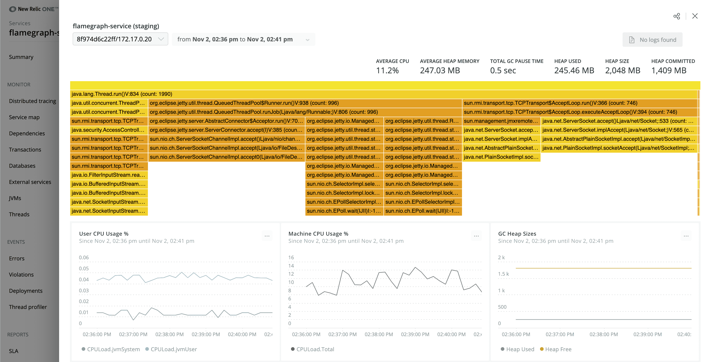

New Relic's [real-time profiling for Java](https://docs.newrelic.com/docs/agents/java-agent/features/real-time-profiling-java-using-jfr-metrics/) using Java Flight Recorder (JFR) metrics allows you to run continuous, always-on profiling of your Java code in production environments. Previously, this feature had to be [manually enabled](https://docs.newrelic.com/docs/agents/java-agent/configuration/java-agent-configuration-config-file/#jfr-real-time-profiling) to use. Now, real-time profiling for Java will be on by default for anyone who installs the Java Agent for the first time or downloads the latest release (v7.1).
In addition to the [Flamegraph feature](https://docs.newrelic.com/docs/agents/java-agent/features/real-time-profiling-java-using-jfr-metrics/#flamegraph), this change makes it easier for Java Agent users to quickly identify what happened during an incident and what performance issues led up to it. Learn more about real-time profiling for Java in our [blog post](https://newrelic.com/blog/nerdlog/real-time-java-profiling) or [watch the demo](https://www.youtube.com/watch?v=qW13jF8SbsQ).

**FAQ**
- **Will this impact my data ingest amount?** Yes, if you don’t already use real-time profiling for Java, then you will see an increase in data ingested.
- **How do I turn off real-time profiling for Java?** If you don’t want to use this feature, you can disable it by [setting the enabled flag to false](https://docs.newrelic.com/docs/agents/java-agent/configuration/java-agent-configuration-config-file/#jfr-real-time-profiling).