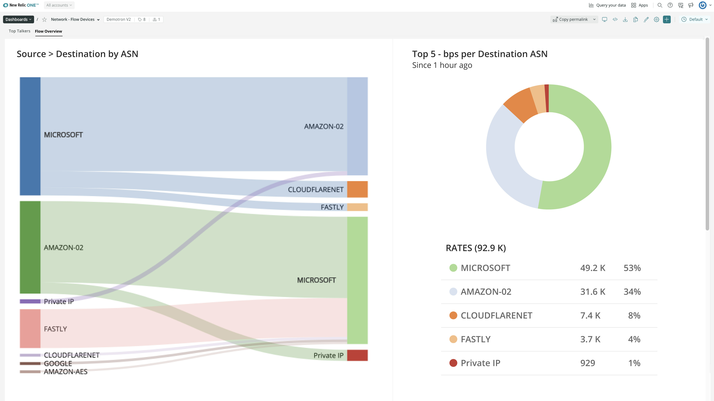

We’re excited to announce the GA release of Network Performance Monitoring (at no additional cost), so you can answer the question, “_Is it the network?_” faster!

When system performance suffers, you need to know if it’s due to your code, your infrastructure, or the underlying network. And you need to know fast, so you can focus your efforts at the right layer with the right team. With Network Performance Monitoring, you can correlate and analyze app, infra, digital experience, and network data all in one place, and understand how network performance and overall system performance impact each other.

* **Streamline detection:** Rule out or rule in the network without paging your network team.
* **Improve Mean Time to Resolution (MTTR):** Apply the right resources at the right layer faster.
* **Increase operational efficiency:** Discover network anomalies by default.

## Solution overview

* **Devices:** Support for all major hardware vendors
* **SNMP:** v1, v2c, and v3
* **Flow:** Streaming telemetry, IPFIX, sFlow, and NetFlow
* **High-cardinality:** Ingest and query high-cardinality network data
* **Platform analytics tools:** Analyze network data alongside app, infra, and digital experience data
* **Anomaly detection:** Discover anomalies on network golden signals

New Relic’s observability platform brings all your observability data together in one place, helping you resolve issues faster. Like any other data flowing into New Relic One, network data is parsed into a set of Golden Signals—automatically curated performance data, such as latency, packet loss, and jitter. Automatic anomaly detection uses these signals to help you discover network anomalies by default. Network-related alerting means you can collaborate on potential problems with network engineers before they manifest into larger issues.

## Get started
In New Relic One, click on **Add more data** or the **Get Started** link above, select the **Network performance monitoring** tile, and follow the instructions. 

To learn more, [click here](https://newrelic.com/platform/network-observability) or the *Learn More* link above. 