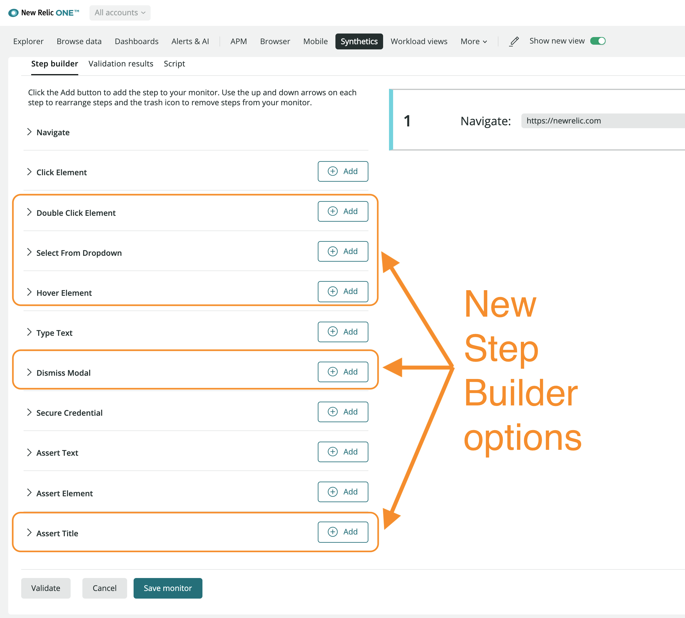

Synthetic private locations are now available in the new UI, which means the [User Step Monitor](https://newrelic.com/blog/how-to-relic/better-synthetic-monitoring) can be used in private locations, including several new steps that were recently added. This also means the new **SSL Certificate Check** and **Broken Links Monitor** will be available in private locations. 

## Summary of the Synthetics updates:

1. **Private Locations in the new view.** Now customers will be able to use the new monitor types in private locations.
2. **SSL Certificate Check Monitor.** This monitor type is easy to set up and checks the expiration and validity period on an SSL Certificate. Now in private locations.
3. **Broken Links Monitor.** Just enter a URL and this monitor will check the entire page for broken links. Now available in private locations.
4. **Step Monitor updates.** New steps available, including Double-Click Element, Select From Dropdown, Hover Element, Dismiss Modal, and Assert Title 

To learn more, [click here](https://docs.newrelic.com/docs/synthetics/synthetic-monitoring/getting-started/types-synthetic-monitors/#types-monitors) or *Learn more* above.