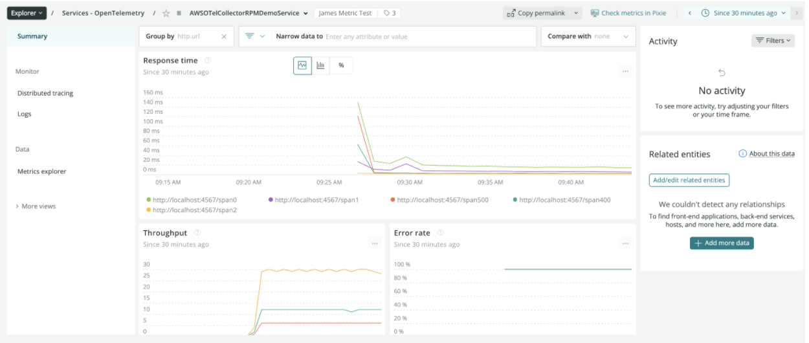

Today, New Relic is excited to announce the general availability of our native support for OpenTelemetry protocol (OTLP) and OpenTelemetry. This includes GA support for trace data and early access support for metrics and logs with our OTLP ingest capability. New Relic’s native support for OTLP features a cost-effective, high-performance observability platform that offers a variety of benefits:

* Long-term storage
* Powerful querying of your telemetry data
* Easy to use dashboarding, analytics, and alerting
* Sophisticated applied intelligence

Combine this with AWS Distro for OpenTelemetry to provide a powerful observability solution for your AWS workloads and infrastructure.

