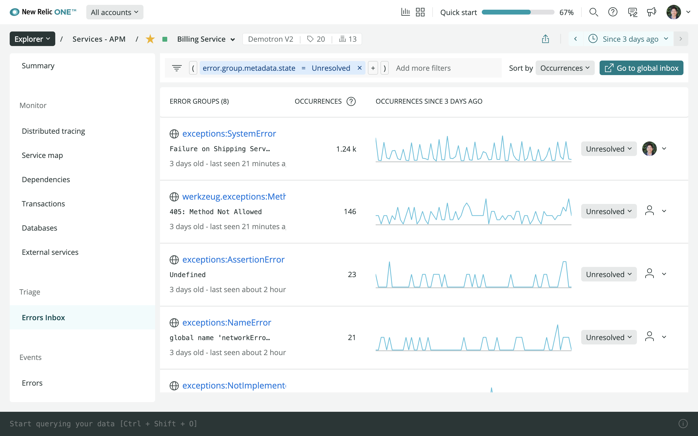

New Relic Errors Inbox is an error tracking solution that provides a single place to view, triage, and resolve errors across the full application stack. Since launch, we have added several major updates:

- **Integration with Slack:** Send error details to Slack for easier collaboration.
- **Attribute Analysis:** Break down error groups by attribute, like username or device used, to help you investigate the root cause of an error.
- **Logs in Context:** Logs in Context are now available within the error details themselves for streamlined root cause analysis with logs.

Now we have added **Errors Inbox to the APM UI**, which makes triaging APM errors a breeze without the need to set up a workload. Read more about the latest updates in our [blog post]( https://newrelic.com/blog/how-to-relic/errors-inbox-with-slack-and-apm).

Watch an extended demo in our recent Nerdlog episode below:
<iframe width="560" height="315" src="https://www.youtube.com/embed/M52jeJsnOfU" frameborder="0" allow="accelerometer; autoplay; clipboard-write; encrypted-media; gyroscope; picture-in-picture" allowfullscreen></iframe>

Watch a quick demo below:
<iframe width="560" height="315" src="https://www.youtube.com/embed/HEbX0dgeGGw" frameborder="0" allow="accelerometer; autoplay; clipboard-write; encrypted-media; gyroscope; picture-in-picture" allowfullscreen></iframe>

