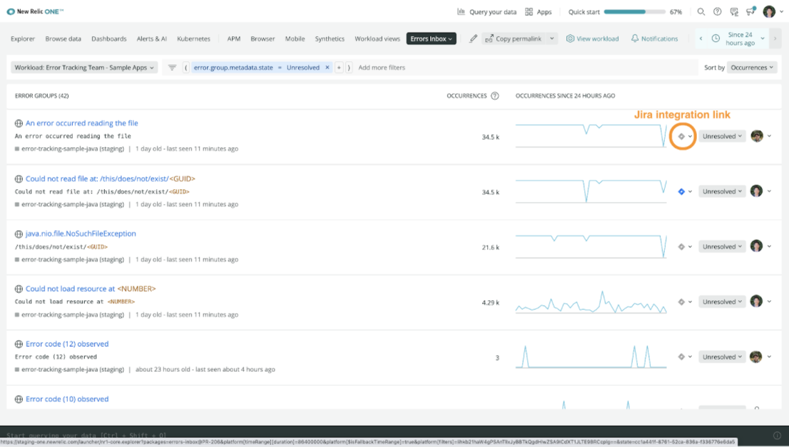

## We’re excited to announce the New Relic errors inbox Jira integration. 

With the Jira integration you can start tracking, managing, and updating tickets from [New Relic errors inbox](/docs/errors-inbox/errors-inbox). Continue to work and collaborate in the tools you're already familiar with without losing context, for faster error resolution.

Start your errors inbox journey today!

