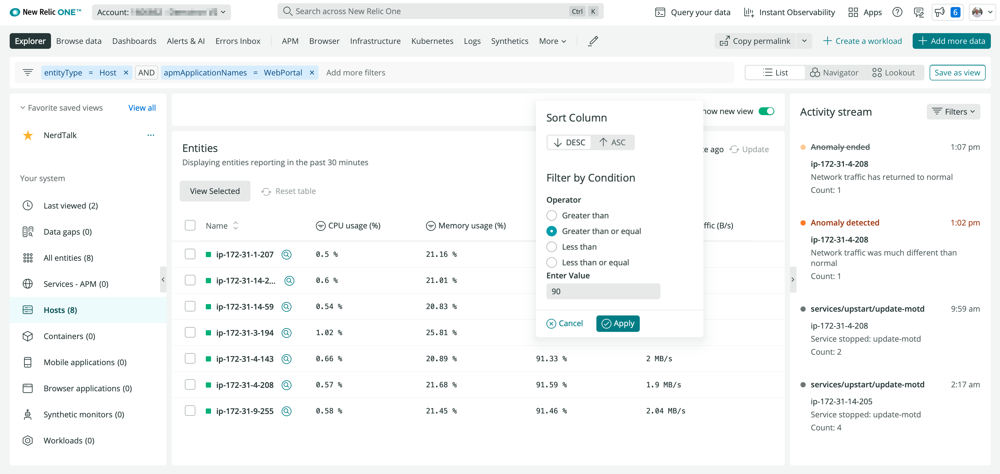
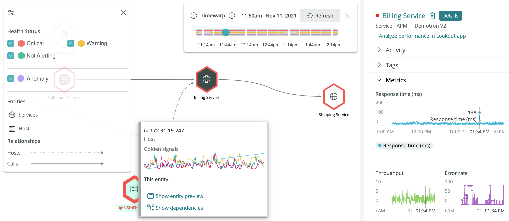

## New infrastructure monitoring customer preview launches today

Today we're releasing the preview of an enhanced New Relic [infrastructure monitoring](https://newrelic.com/products/infrastructure) experience to help DevOps, SRE, and IT Operations teams quickly pinpoint offending infrastructure components, determine incident blast radiuses, and identify the root cause.

New infrastructure monitoring interface makes it easy to find possible issues.

**Highlights**

1. Pinpoint bottlenecks instantly using Lookout to know where to focus your attention.
2. Be proactive and find potential infrastructure issues before they affect your customers.
3. Quantify blast radius and determine the impact of an incident by visualizing the up and downstream dependencies using automap.
4. Investigate root cause by analyzing related entities, logs, alerts, events, golden signals, network metrics, and more all in context and in a unified experience to identify the root cause and resolve issues faster.

[Automap](https://docs.newrelic.com/docs/new-relic-one/use-new-relic-one/ui-data/automaps/) shows topology and the blast radius. [Timewarp](https://docs.newrelic.com/docs/new-relic-one/use-new-relic-one/ui-data/automaps/#timewarp-cursor) helps to find what and when an issue happened.

With our new infrastructure monitoring experience, we’ve doubled down on providing real-time troubleshooting workflows while incorporating broader platform context and unique topology visualizations into our user experience.

Check out our new infrastructure monitoring experience and tell us what you think. New Relic customers can start using it today, without any additional cost. Find it in New Relic One within the main menu under **[Infrastructure > Hosts New](https://onenr.io/08dQepE9Wje)**.

**Note:** as of December 13th, 2021, the new infrastructure monitoring experience is available in the EU.
