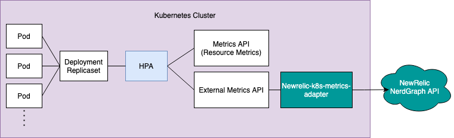

## We’re excited to announce the open beta of the New Relic Horizontal Pod Autoscaler (HPA).

The [Horizontal Pod Autoscaling](https://kubernetes.io/docs/tasks/run-application/horizontal-pod-autoscale/) (HPA) feature, which was introduced in Kubernetes v1.2, allows users to autoscale their applications off of basic metrics like CPU, accessed from a resource called metrics-server.

With Kubernetes v1.6, it became possible to autoscale off of user-defined custom [external metrics](https://kubernetes.io/docs/tasks/run-application/horizontal-pod-autoscale-walkthrough/#autoscaling-on-metrics-not-related-to-kubernetes-objects) collected from within the cluster.

## Get started with the New Relic Metrics adapter.

New Relic metric adapter is only available for Kubernetes v1.16 and above. To see the list full of requirements check the following [link](https://docs.newrelic.com/docs/kubernetes-pixie/kubernetes-integration/newrelic-hpa-metrics-adapter/newrelic-metrics-adapter/#installation).

By using Helm charts any New Relic user can easily install our [Kubernetes integration](https://docs.newrelic.com/docs/kubernetes-pixie/kubernetes-integration/installation/kubernetes-integration-install-configure/) with HPA or simply update it to enable the New Relic metric adapter.

Find more information about the installation process [here](https://docs.newrelic.com/docs/kubernetes-pixie/kubernetes-integration/newrelic-hpa-metrics-adapter/newrelic-metrics-adapter/#installation).
