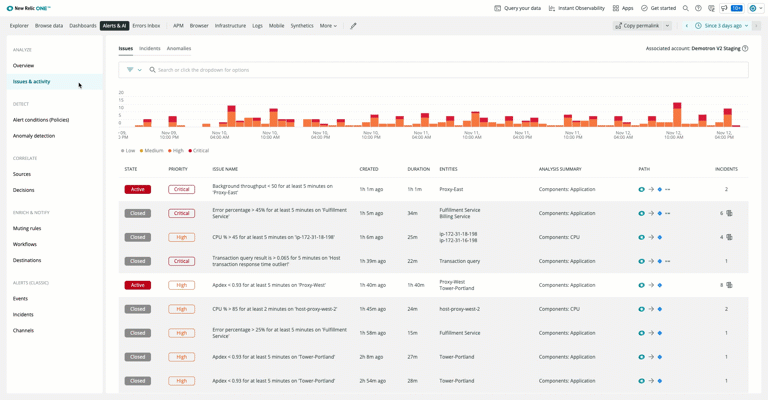

New Relic full platform users will have access to modern AIOps capabilities in Applied Intelligence at no additional cost. This incremental rollout begins now and should be completed by the end of 2021. Applied Intelligence empowers on-call engineers to eliminate alert storms by grouping related alerts from any source into one actionable issue, and quickly see the root cause of issues when incidents occur.

We are also introducing improvements to the incident response experience to help on-call engineers achieve faster time-to-resolution, reduced noise, and increased reliability.

The most obvious change is a new navigation menu on the left side of Alerts & AI that has been redesigned to better match your incident response journey. You will also see new advanced features including:

* **Workflows**: Provides a flexible way to route incidents with specific characteristics to appropriate teams and specific ticketing or notification tools, such as ServiceNow and JIRA. You can also use custom webhooks to integrate other services.

* **Enrichment**: Allows you to query data in NRDB, collect pertinent related information, and use predefined parameters so that you can automatically add additional context to your alerts before they are sent to first responders. 

 * **Destinations**: New bi-directional integrations for JIRA and Service Now accommodate for customizable fields and additional transactional security. Future integrations under development include email, PagerDuty, AWS EventBridge, and Microsoft Teams.

To get started reducing alert noise and quickly finding the root cause of incidents, visit the [**Alerts & AI**](https://onenr.io/0nVjYZ0a3Q0) tab in the upper navigation banner. 
