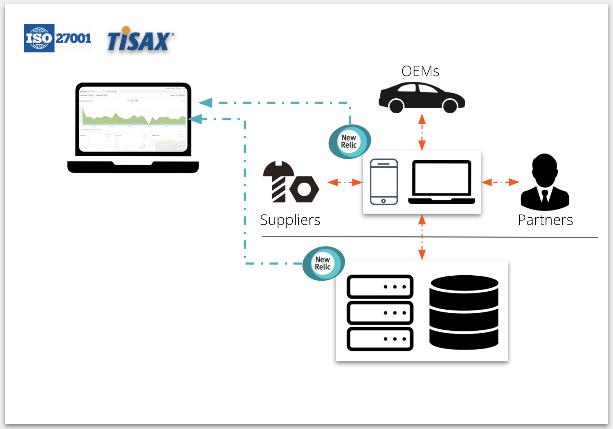

The last thing you want to do is think about compliance, which is why we’ve upgraded the New Relic One platform to be TISAX- and ISO 27001-compliant! And best of all, there's nothing for you to do—compliance is built directly into the platform.

Building on our support for GDPR, FedRAMP, SOC2, CSA STAR, and DHS, **TISAX** and **ISO 27001** further allow you to confidently monitor your application, infrastructure, and network performance while protecting your customers' data. New Relic’s platform allows you to adhere to industry best practices for security and governance so you can optimize supplier, OEM, and partner experiences while safeguarding data.

New Relic is the **only** observability platform with both TISAX and ISO 27001 compliance for all your performance data, all in one place:
* **Domains**: Applications, infrastructure, network
* **Data types**: Metrics, events, logs, and traces
* **Environments**: On-premises and cloud

