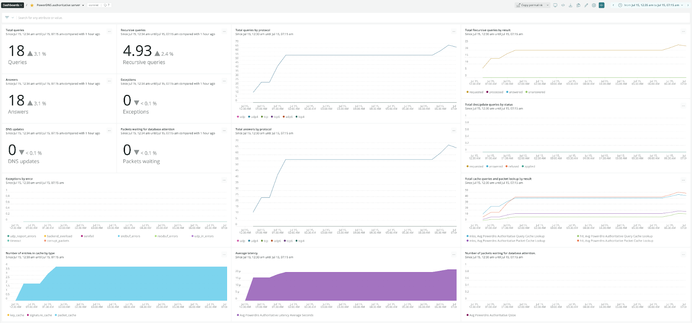

## We’re excited to announce the New Relic Infrastructure’s PowerDNS integration.

Customers with a subscription to New Relic One can now pull data from their PowerDNS servers directly into New Relic without installing any third-party software. This on-host integration allows you to track key metrics and gain critical insights into how your PowerDNS is performing, giving you improved visibility into the parts of your infrastructure served by PowerDNS.

## New Relic offers observability for the two main products of the PowerDNS platform.

1. Authoritative server
2. Recursor

## Troubleshoot your PowerDNS infrastructure faster.

Check the status of your PowerDNS infrastructure by accessing the Entity Explorer.

You will easily identify the actual status by reviewing the most important metrics on a summarized list.

## View your authoritative server dashboard.

Check the health of your authoritative servers by looking at the information provided by the dashboard.

## Get started with the PowerDNS integration.

This integration is compatible with PowerDNS authoritative server and recursor 3.x and above.

For installation configuration and exact compatibility requirements, check our [PowerDNS integration for New Relic documentation.](https://docs.newrelic.com/docs/infrastructure/host-integrations/host-integrations-list/powerdns-monitoring-integration/)
