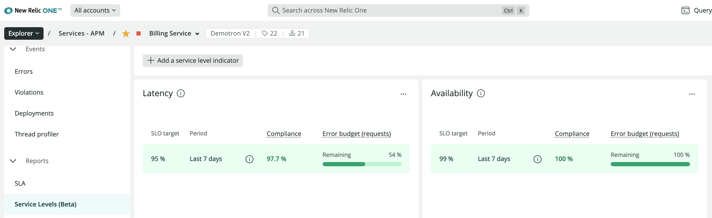

## Public beta for New Relic's service level management

We're excited to announce the public beta for service level management!

New Relic One’s new, simple interface for service level management (beta) makes it easy to understand how your services' performance and reliability are doing over time. When an SLO target is not met (or is close to failing for the evaluation period), use New Relic to find contextual data around deployments, infrastructure changes, anomalies, and issues that could be the cause. Now, your DevOps, IT, and SRE teams can identify problems anywhere in the stack and proactively resolve reliability concerns. Service level data is essential for you to make decisions about how to proceed when an incident occurs, and will help influence how you prioritize innovation and reliability work in your product roadmap.

You can learn more about this release and how you can implement service level management in [our docs](https://docs.newrelic.com/docs/service-level-management/intro-slm). Or go to the Service Levels (Beta) menu within any APM Service for an automatic SLI baseline and setup.  

