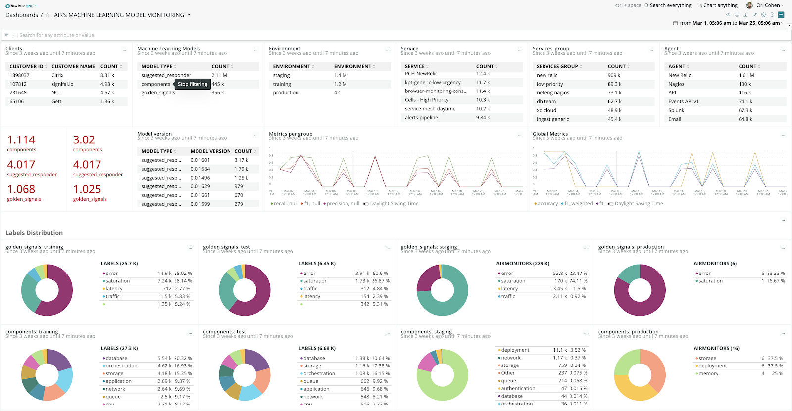

## Now you can monitor your ML models in production with Model Performance Monitoring

ML Engineers and data science teams can now bring ML model telemetry from any source into New Relic One and collaborate with DevOps and SREs teams to maintain high-performing Artificial Intelligence (AI) and Machine Learning (ML) powered applications.

Everything you need in one place:

* Monitor ML models and dependencies alongside their software applications and infrastructure to solve problems faster.
* Create custom dashboards to gain trust and insights for better, more accurate ML models.
* Get predictive alerts to ML Models performance with Applied Intelligence to detect unusual changes & unknowns early, before customers are impacted.
* Monitor & visualize critical signals like recall, precision, accuracy, and more.
* Collaborate in a production environment and gain unprecedented visibility to ensure maximum business impact of your data science investments.

New Relic I/O ecosystem offers flexible quickstarts and easy integrations to leading data science platforms like AWS Sagemaker, Algorithmia (DataRobot), Aporia, Superwise, Comet, DagsHub, Mona, and TruEra.

