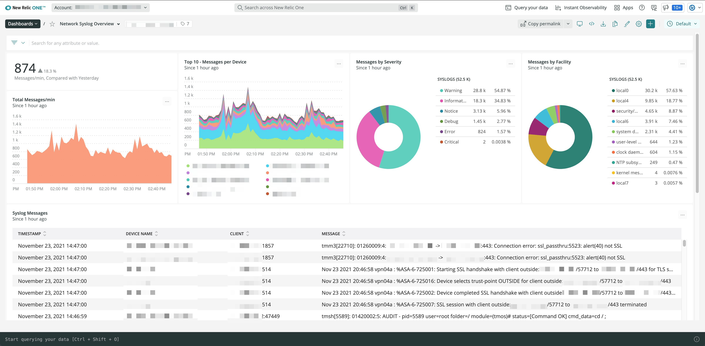

# Understand how your network impacts your infrastructure and application layers.
## Correlate Syslog messages with the rest of your observability data.

* Analyze Syslog messages alongside SNMP and Network flow logs across all network equipment with other network, infrastructure, and application telemetry.
* Automatically detect Syslog-based anomalies (using Lookout) before they cause problems.
* Surface patterns and potential issues with zero-configuration Log Patterns.
* Stay in compliance with our FedRAMP-certified solution.

## How to configure Syslog with New Relic
Open the [**Instant Observability (I/O) quickstart**](https://developer.newrelic.com/instant-observability/network-syslog/478be4d3-134a-4738-995a-7bbe020edcad/) for a guided installation that will also deploy an example dashboard. Alternatively, you may follow along manually using our [**documentation**](https://docs.newrelic.com/docs/network-performance-monitoring/setup-performance-monitoring/network-syslog-monitoring/).

