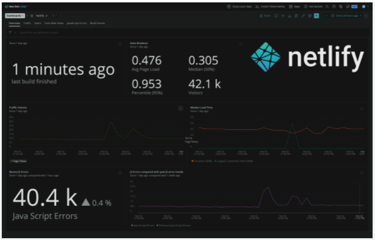

Built for developers who want to know how their deploys are impacting site performance for users, the New Relic Plugin for Netlify enables you to automatically install the [New Relic browser](https://docs.newrelic.com/docs/browser/browser-monitoring/getting-started/introduction-browser-monitoring/) agent and notifies New Relic each time [a build event](https://docs.netlify.com/configure-builds/build-plugins/create-plugins/#plug-into-events) occurs in Netlify. Get critical insights via [Real User Monitoring RUM](https://newrelic.com/products/browser-monitoring)into the performance of your jamstack application. Learn more here.

Doing so gives you the following benefits:

* Understand how each deploy impacts your site’s performance metrics in production.
* Measure Google Core Web vitals on your site like Largest Contentful Paint, First Input Delay, and Cumulative Layout shift.
* Quickly discover and fix errors before they impact your users. 
* Explore your data using our custom-built dashboards and receive alerts/notifications when there’s an issue with your Netlify site. 

## How to configure pluging with New Relic

Open the [Instant Observability (I/O) quickstart](https://developer.newrelic.com/instant-observability/netlify/5861d7f5-26c0-43ad-bda8-c893c4b27b25/) for a guided installation that will also deploy an example dashboard. Alternatively, you may follow along manually using our [documentation](https://github.com/newrelic-experimental/netlify-plugin).

