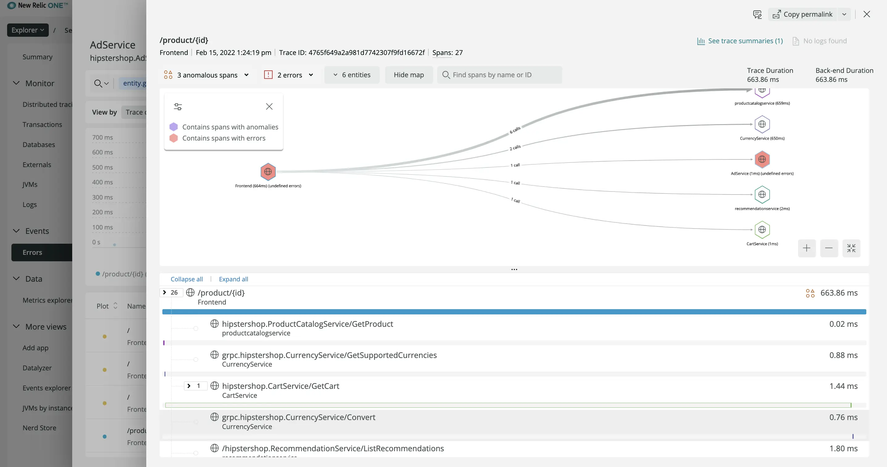

As the OpenTelemetry project continues to mature, we’re continuously evolving our support for OpenTelemetry in New Relic. New Relic's OpenTelemetry offering now includes:

- OTLP support for HTTP/1.1 
- Infinite Tracing with gRPC
- Enhanced curated user experiences to visualize and analyze your OpenTelemetry data

