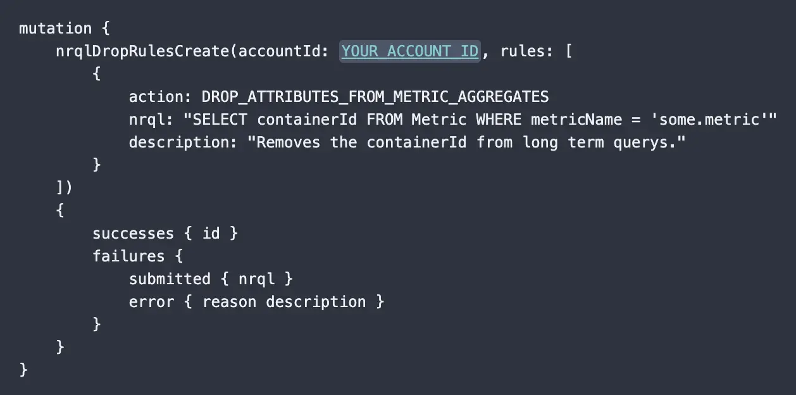

**Metric aggregate pruning** is our latest addition to the NerdGraph drop rules data management API. It allows you to specify one or more attributes to exclude from metric data rollups. Attributes that are excluded from rollups are not dropped entirely (we have a separate action for that purpose). They are still available and queryable on the raw metric data, which is used when querying over time windows of one hour or less, or when you specify the **RAW** keyword on your query (which can be used on queries spanning time windows of up to 48 hours). But attributes pruned from rollups using this new capability are not counted against your cardinality limits, making them a valuable new tool for cardinality management.

Metric aggregate pruning is ideal for high cardinality attributes sometimes included on metrics, such as a container id or other unique identifiers. They contain important details when troubleshooting during an incident (narrow time window), but they lose their value over time and are not relevant when looking for longer term trends.

# How to get started
To learn more, check out our [Docs](https://docs.newrelic.com/docs/data-apis/manage-data/drop-data-using-nerdgraph/#drop-attributes-on-dimensional-metric-rollups).

