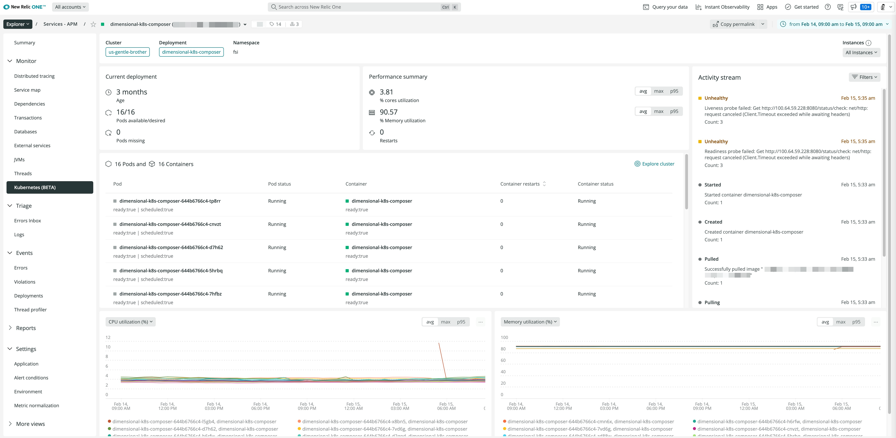

## See Kubernetes details in APM

Use our new UI that shows how cluster performance impacts your applications.

* Analyze cluster performance in a single, curated UI.
* Get alerted with a real-time activity stream for Kubernetes events and critical issues.
* Correlate performance anomalies with one-click logs and side-by-side (selectable) metrics.

## How to get started
Go to [**APM**](https://onenr.io/08dQea8qYQe), or in the left hand navigation, select **Kubernetes**. Note that in order to see Kubernetes performance data in New Relic One, you must meet the following prerequisites:

* Install the New Relic [infrastructure integration](https://docs.newrelic.com/docs/kubernetes-pixie/kubernetes-integration/installation/install-kubernetes-integration-using-helm/).
* See our documentation about [New Relic APM](https://docs.newrelic.com/docs/apm/new-relic-apm/getting-started/introduction-apm/).
* Ensure users have [**Full user** licenses](https://newrelic.com/pricing).

Alternatively, you may follow along manually using our [documentation](https://docs.newrelic.com/docs/network-performance-monitoring/setup-performance-monitoring/network-syslog-monitoring/).

