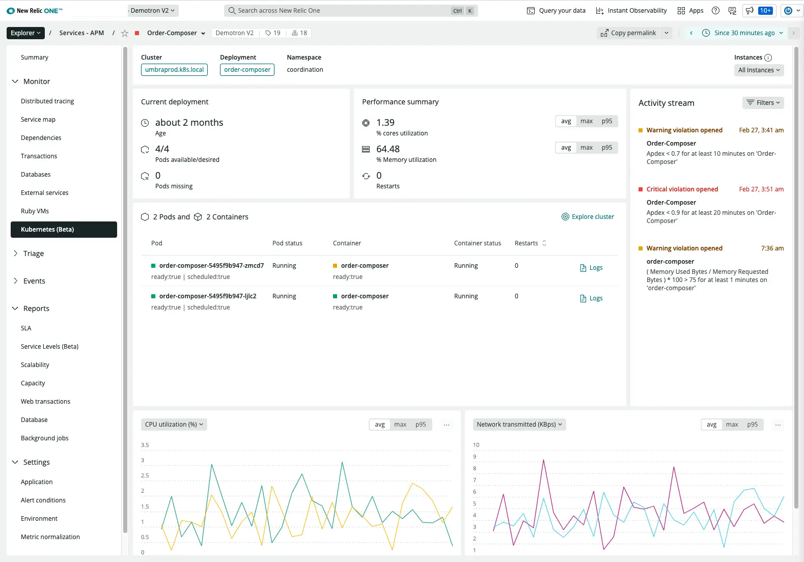

## See Kubernetes details in APM

Use our new UI that shows how cluster performance impacts your applications.

* Analyze cluster performance in a single, curated UI.
* Get alerted with a real-time activity stream for Kubernetes events and critical issues.
* Correlate performance anomalies with one-click logs and side-by-side (selectable) metrics.

## How to get started
Kubernetes information in APM is available in **[one.newrelic.com](https://one.newrelic.com/all-capabilities) > Explorer > Services - APM > (select an app) > Kubernetes**.

To make sure your Kubernetes performance data appears in New Relic One:

* Install the New Relic [infrastructure integration](https://docs.newrelic.com/docs/kubernetes-pixie/kubernetes-integration/installation/install-kubernetes-integration-using-helm/).
* See our general [APM](https://docs.newrelic.com/docs/apm/new-relic-apm/getting-started/introduction-apm/) documentation, as well as information about the [Kubernetes summary page](https://docs.newrelic.com/docs/apm/apm-ui-pages/monitoring/kubernetes-summary-page).
* Ensure users have [**Full user** licenses](https://newrelic.com/pricing).

