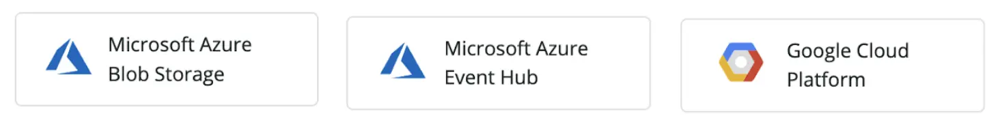

All existing New Relic accounts using Microsoft Azure or Google Cloud Platform cloud infrastructure integrations can now send logs to New Relic One without the need for unsupported forwarders or custom solutions published by customer success teams.

Sending logs to New Relic One is a great way to get more detailed and comprehensive information about the services and instances running on your cloud providers. Monitoring logs alongside metrics make it easier to troubleshoot and identify the root cause of issues faster.

New logs integrations:

* **For Azure:** Blob Storage, or via an Event Hub
* **For GCP:** pub/sub integration

<figcaption>Azure and GCP log integrations are part of New Relic’s log forwarding plugins that make it easy for our customers to get logs into New Relic One.</figcaption>

To start using logs with Azure or GCP, or any of New Relic’s native log integrations:

1. Click this [**+ Add More Data**](https://one.newrelic.com/marketplace?state=7ca7c800-845d-8b31-4677-d21bcc061961) link.
2. In the search bar, type **logs**, and press Enter to see your options.
