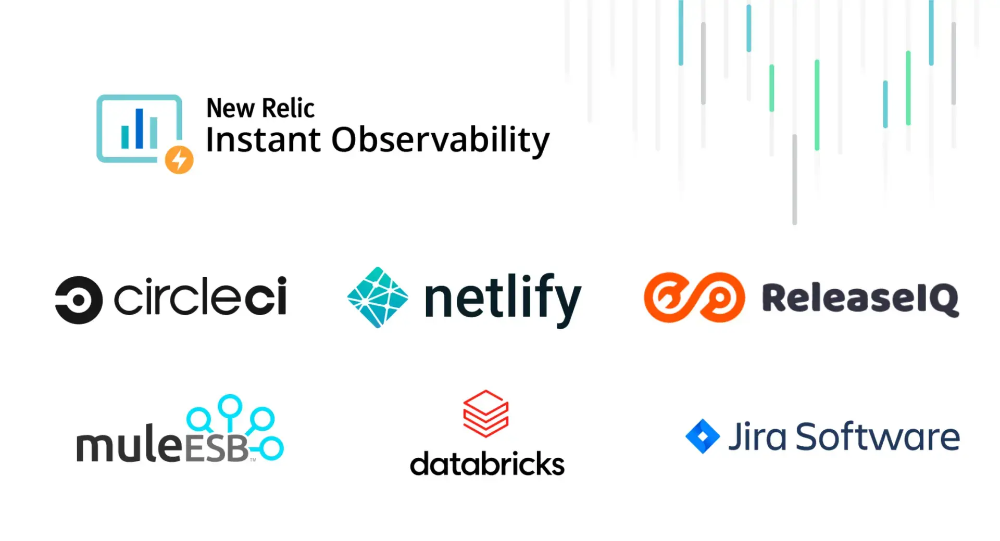
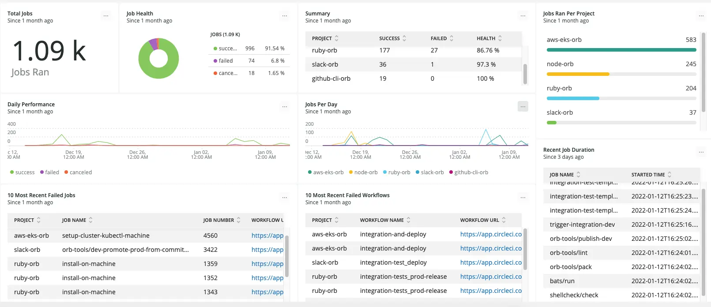

In case you missed it, [New Relic I/O](https://docs.newrelic.com/whats-new/2021/10/instant-observability-10-13-21) helps you instrument, monitor, and analyze your stack in minutes. The secret ingredient: [450+ free expert-built quickstarts](https://developer.newrelic.com/instant-observability/) that bundle the integrations, guides, dashboards, and alerts for the technologies you rely on.

## New integrations for instant observability

The latest cohort of partners contributing to making observability a daily habit for engineers spans across CI/CD platforms, integration platforms, data analysis, and agile project management. These partners include:

**CI/CD**: Gain visibility into the performance and health of your continuous integration and deployment pipelines
* [CircleCI](https://newrelic.com/instant-observability/circleci/39109d3d-b1d8-4366-8ca9-b8925005f727/)
* [Netlify](https://newrelic.com/instant-observability/netlify/5861d7f5-26c0-43ad-bda8-c893c4b27b25/) | [tutorial](https://youtu.be/BuJZXcw_Msg)
* [ReleaseIQ](https://newrelic.com/instant-observability/releaseiq/88dee43d-f259-4423-9a14-d8553d8ac7a8)

**Integration platforms**: Monitor Mule ESB with New Relic's Java agent
* [Mule ESB](https://newrelic.com/instant-observability/mule-esb/fb550b47-c33b-48a8-be4f-5cf469d34b59)

**Data analytics**: Track cluster health and fine tune Apache Spark jobs
* [Databricks](https://newrelic.com/instant-observability/databricks/533cdd19-8232-42cb-b134-e7d17bfff581)

**Agile project management**: Connect Jira with error tracking
* [Atlassian Jira for Errors Inbox](https://newrelic.com/instant-observability/jira-errors-inbox/06734d77-b06a-4410-aafa-eed1944c0ac4/) | [tutorial](https://www.youtube.com/watch?v=AidzzD4SHko)

## Visualize and monitor all your data in one platform
Learn more about how each of these partner-built quickstarts can help you quickly expand your observability game by reading this [blog post](https://newrelic.com/blog/nerdlog/integrations-for-ci-cd-analytics#toc-instant-observability-for-data-analytics). Or, dive into New Relic I/O and [find a quickstart](https://onenr.io/0Bj3BBAdbRX) for your stack.

