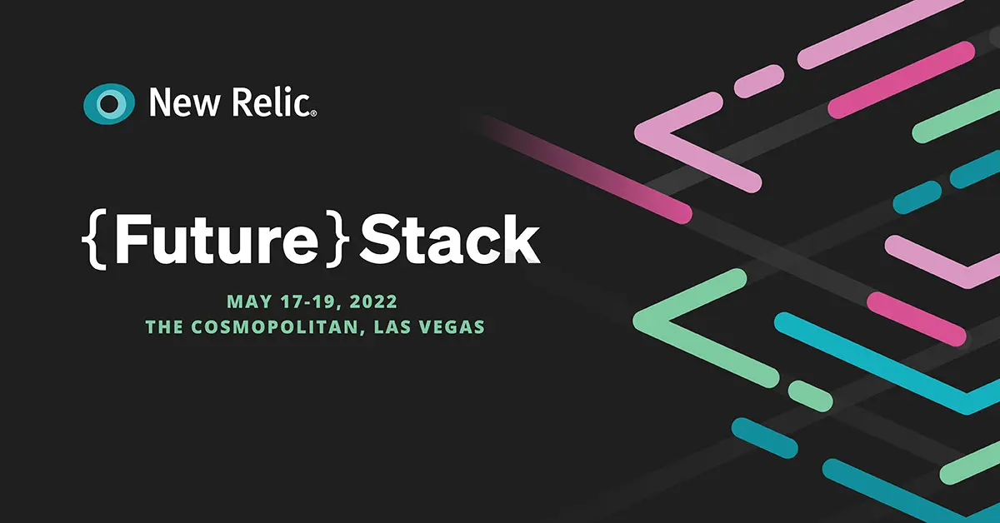

## Join us for FutureStack May 17-19 at the Cosmopolitan of Las Vegas

Reconnect face-to-face and find out what your most innovative peers are doing.

[Register Now](https://www.futurestack.com/anqQXE?RefId=WHATSNEW)

Explore observability with inspiring keynotes, peer-led deep dives, and exclusive technical breakouts you won’t find online.

## FutureStack is back, bigger and bolder than ever

It’s time to log off from virtual events, dust off your suitcase, and join your peers to rub elbows and swap cheat codes in a way that’s only possible in live, in-person interactive sessions. 

**Reasons all the data points to Las Vegas:**
* **1:1 expert guidance** for a deep dive on observability
* **An inside look** at the newest New Relic innovations
* **Blockbuster announcements** for new products and more
* **Networking events** and exclusive entertainment, Vegas style

## Look who’s sharing their observability insights
Our peer-led sessions feature industry leaders, including:
* **JJ Asghar** - IBM
* **Carl Chesser** - Cerner 
* **Sheldon Lessard** - Maricopa County Clerk of the Superior Court

## Drop in and code on, at the 24-hour FutureHack 

Put your skills to the test by using a data-driven approach to hack your way through the toughest observability challenges using New Relic. The FutureHack champions will win bragging rights and great prizes. 

## Get excited, get inspired and get registered for the software engineering event of the year

Take advantage of special early-bird pricing (good until April 30) and a hotel discount at The Cosmopolitan of Las Vegas (good until April 15). Spots are filling up fast, so register now. 

[Register for FutureStack](https://www.futurestack.com/anqQXE?RefId=WHATSNEW)
