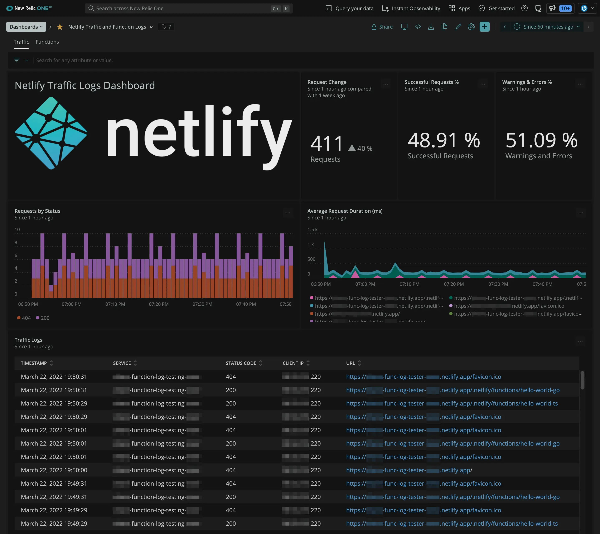

The New Relic Netlify integration is built for enterprise customers who want visibility of log data without the manual work. This integration allows you to import logs into the log management solution of your choice. Then, you can analyze that data for troubleshooting and performance monitoring or store it for historical purposes. Learn more in our [blog](https://newrelic.com/blog/nerdlog/monitoring-netlify-sites).

Here are some key benefits:

* User traffic monitoring: Identify traffic from bots and bad actors, which can help your security and compliance engineers proactively defend your sites.
* Access and analyze your Netlify traffic logs: Traffic logs are only accessible through log drains, not the Netlify UI.
* Long-term log retention: The Netlify console provides a 24-hour storage window for logs. The Netlify console provides a 24-hour storage window for function logs. With New Relic One, you get long-term cold storage for your Netlify log data and the ability to make month-over-month comparisons.
* User agent analytics: Analyze your user agents for performance issues.
* Session tracking: Gain insight into user activity and journeys across your sites.

## How to configure the plugin with New Relic

Open the [Instant Observability (I/O) quickstart](https://newrelic.com/instant-observability/netlify-logs/63f08781-18ad-4a89-ae63-49718deee041) for a guided installation that will also deploy an example dashboard.

Alternatively, you can follow along manually using the [documentation](https://docs.netlify.com/monitor-sites/log-drains/).

