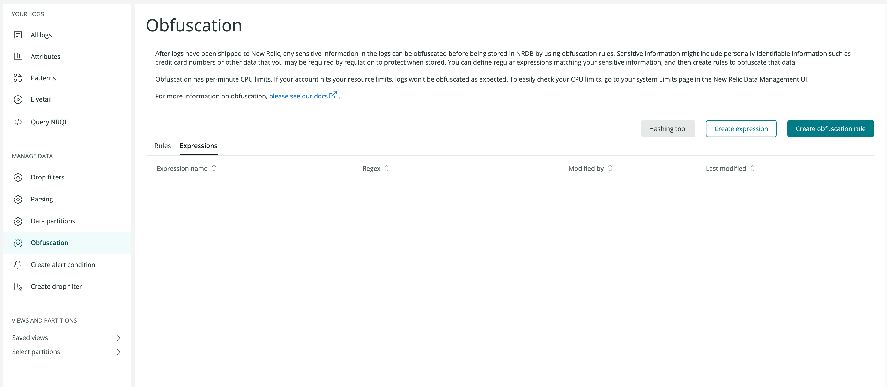

--- 
title: 'New obfuscation features now available in log management'
summary: 'The new functionality makes it easy to keep sensitive data out of logs'
releaseDate: '2022-03-30'
learnMoreLink: 'https://docs.newrelic.com/docs/logs/ui-data/obfuscation-ui/'
getStartedLink: 'https://one.newrelic.com/launcher/logger.log-launcher'
---
 
New Relic makes it easy for you to ensure data privacy and follow your organization's logs security guidelines with new obfuscation options now available in Logs.
 
Define regular expressions to mask or hash data you want to protect and easily create custom rules before sensitive information is being stored, all directly available in the Logs user interface without the need for lengthy manual configurations.
 
Try it out:
 
1. Go to [**Logs**](https://one.newrelic.com/launcher/logger.log-launcher) in New Relic One and from the left nav, select **Obfuscation**.
 
2. Select **Create expression** or **Create obfuscation rule** to get started.
 

 
New Relic's log management already helps you troubleshoot issues faster with simplified navigation, dashboard visualizations, the best logs in context, and now, a simple way to control what log data you may be required to protect.
 
To know more, see our documentation about [log management security and privacy](https://docs.newrelic.com/docs/logs/get-started/new-relics-log-management-security-privacy).
