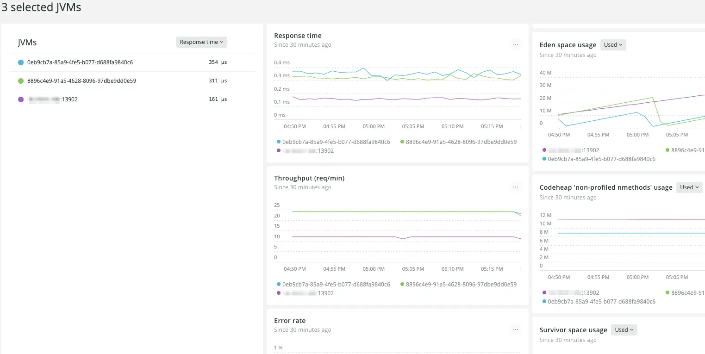

An updated JVMs page for services instrumented with OpenTelemetry allows you to identify which service instances have unusual or unhealthy performance patterns. You can compare the key service health and Java Virtual Machine (JVM) metrics, across any number of instances.

With this data, you can:

  * Determine which instances might need their JVM garbage collection or memory settings tuned for a better fit to their load.
  * Identify instances receiving an unbalanced amount of traffic.
  * Spot slow memory leaks.

On the new JVMs page, you can choose several service instances to compare, based on summaries of key metrics: response time, throughput, error rate, garbage collection time, and memory usage. Then, you can compare all those instances' JVM metrics collected by OpenTelemetry instrumentation using timeseries charts to spot problems.