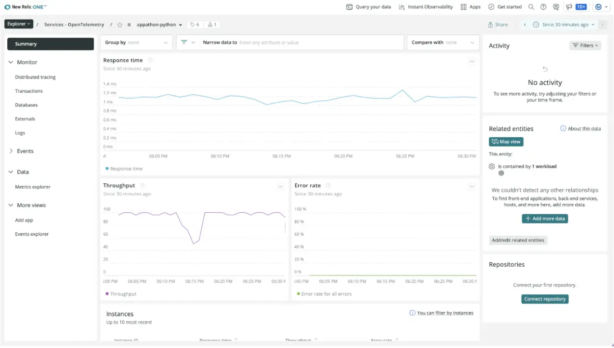

Learn the ins and outs of OpenTelemetry starting with the basic concepts arounds telemetry, followed by key concepts and components of OpenTelemetry, and end with a hands-on workshop that shows you how to instrument an application in your preferred language and analyze data in New Relic.

