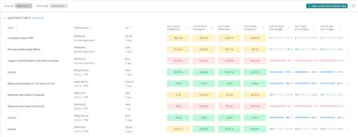

## Service Level Management is now generally available in New Relic One

Today, we're excited to announce that New Relic service level management is now generally available!

New Relic One's new service level management capabilities help teams operationalize SRE best practices for maintaining system uptime and reliability. The new experience includes a one-click Service Level Indicator (SLI) and Service Level Objective (SLO) setup, powerful recommendations to get started, metrics customization, unified health reports, and alerting for SLO compliance, error budget tracking, and more.

You can learn more about this new release and how you can implement service level management in our [SLM documentation](https://docs.newrelic.com/docs/service-level-management/intro-slm/) or by reading our [use case implementation guide](https://docs.newrelic.com/docs/new-relic-solutions/observability-maturity/uptime-performance-reliability/slm-implementation-guide/).