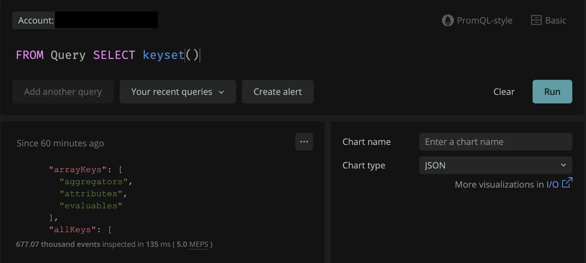

Analyze array attributes for OpenTelemetry Protocol (OTLP), including simple arrays containing boolean, integer, long, float, double, or string values. Run queries with arrays just like other data types, including faceting on array attributes.

The OpenTelemetry spec supports array data types for metrics, traces, and logs, including custom array attributes. Additionally, some built-in OpenTelemetry fields can hold array data as well.

# How to get started
To learn more, check out the [docs page](https://docs.newrelic.com/docs/query-your-data/nrql-new-relic-query-language/get-started/arrays-in-nrql/).

