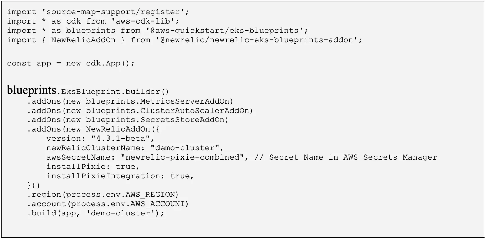

If you are using AWS Elastic Kubernetes Service (EKS) to build a [Shared Services Platform (SSP)](https://aws-quickstart.github.io/cdk-eks-blueprints/), you can deploy New Relic's Kubernetes observability integration using our [add-on to EKS Blueprints](https://www.npmjs.com/package/@newrelic/newrelic-eks-blueprints-addon).

## Benefits for infrastructure engineers
* Turnkey deployment that simplifies the standard Helm install.
* Frictionless upgrades across all clusters as part of a deployment pipeline or via CDK deploy.
* Analyze and alert on node capacity and utilization metrics.

## Benefits for developers
* Analyze and alert on status and utilization metrics for Kubernetes workloads running in the cluster.
* Collect Kubernetes events to identify resource constraints, scheduling issues, etc.
* One-click access to container logs for easier troubleshooting.
* Combine with New Relic APM for correlation between application, infrastructure, and log data.

## How to get started
To learn more, check out the [step-by-step instructions](https://aws.amazon.com/blogs/apn/simplifying-kubernetes-observability-with-amazon-eks-blueprints/) or watch a [3-minute demo video](https://youtu.be/WHO5T_7-5es).

