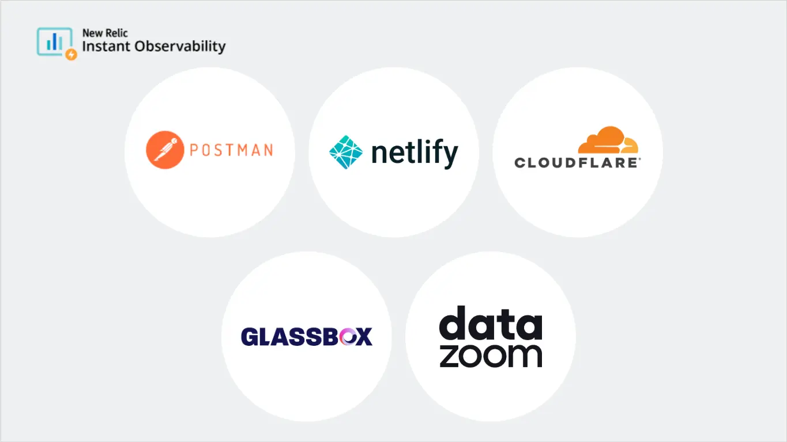
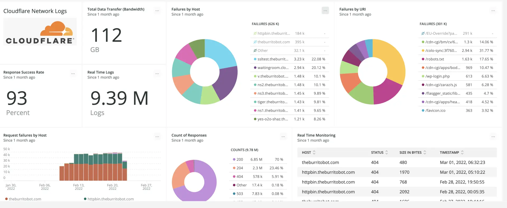
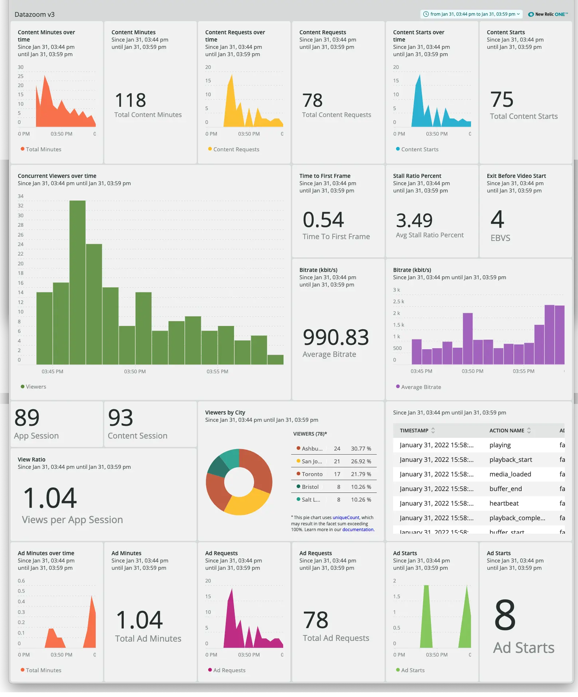
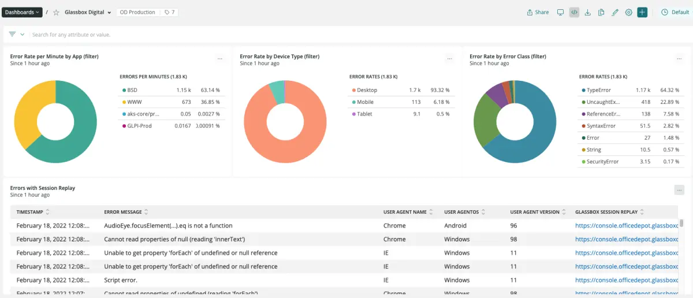

[New Relic Instant Observability (I/O)](https://newrelic.com/instant-observability/) is an open ecosystem of more than 450 free, prebuilt quickstarts that help you start monitoring your system in minutes. These quickstarts bundle necessary building blocks for instrumenting, monitoring, and acting on signals from your telemetry data, wherever it comes from. 

We are pleased to announce new integrations and quickstarts with **[Cloudflare](https://newrelic.com/instant-observability/cloudflare/fc2bb0ac-6622-43c6-8c1f-6a4c26ab5434)**, **[Netlify](https://newrelic.com/instant-observability/netlify-logs/63f08781-18ad-4a89-ae63-49718deee041)**, **[Postman](https://newrelic.com/instant-observability/postman/d465bf08-b737-4bc5-b5ad-dd5be272967b)**, **[Datazoom](https://newrelic.com/instant-observability/datazoom/2ffed926-6ee2-43b2-a942-344192fdf418)**, and **[Glassbox](https://newrelic.com/instant-observability/glassbox/bdb952f3-28db-4ee7-89c6-b00244b0bb73)**. Read on for a summary, or read [the full blog post about these integrations](https://newrelic.com/blog/nerdlog/integrations-api-network-streaming-apm).

## Cloudflare Network Logs

[Cloudflare](https://www.cloudflare.com/) is an industry-leading global network designed to make everything you connect to the Internet secure, private, fast, and reliable. The new [Cloudflare Logpush](https://developers.cloudflare.com/logs/) integration sends Cloudflare data directly into New Relic, resulting in faster log delivery and eliminating cloud storage middleware costs. The [Cloudflare Network Logs quickstart](https://newrelic.com/instant-observability/cloudflare/fc2bb0ac-6622-43c6-8c1f-6a4c26ab5434) allows you to monitor and analyze web traffic metrics from Cloudflare Logpush on a New Relic dashboard, providing you with an overview of important logs and metrics from all your websites and applications.

**Resources:**
* [Cloudflare Network Logs quickstart](https://newrelic.com/instant-observability/cloudflare/fc2bb0ac-6622-43c6-8c1f-6a4c26ab5434)
* Visit our blog for more information about how to [send log insights faster and cheaper](https://newrelic.com/blog/how-to-relic/cloudflare-log-integration) through the Cloudflare integration.
* Read about how to [get full observability into your Cloudflare logs with New Relic](https://blog.cloudflare.com/announcing-the-new-relic-direct-log-integration/) on Cloudflare's blog.

## Netlify Logs

As a pioneer of the Jamstack movement, [Netlify](https://www.netlify.com/) brings together modern web frameworks, serverless functions, and edge computing into one platform to deliver unmatched experiences for your application users. With the [Netlify Logs quickstart](https://newrelic.com/instant-observability/netlify-logs/63f08781-18ad-4a89-ae63-49718deee041), you can explore and visualize data from traffic and function logs provided by [Netlify log drains](https://docs.netlify.com/monitor-sites/log-drains/). It allows you to parse, view, and filter traffic logs and function logs generated by your Netlify workloads for in-depth analysis, performance monitoring, troubleshooting, and alerting within New Relic. 

Watch our video tutorial on how to view Netlify logs in New Relic: 

<iframe width="560" height="315" src="https://www.youtube.com/embed/9rBUDKO5qNs" frameborder="0" allow="accelerometer; autoplay; clipboard-write; encrypted-media; gyroscope; picture-in-picture" allowfullscreen></iframe>

**Resources:**
* [Netlify Logs quickstart](https://newrelic.com/instant-observability/netlify-logs/63f08781-18ad-4a89-ae63-49718deee041)
* Head to our blog to learn more about [exporting traffic and function logs from Netlify to New Relic](https://newrelic.com/blog/nerdlog/monitoring-netlify-sites).
* Check out Netlify's Explorers Hub post on how to [view logs data with New Relic](https://discuss.newrelic.com/t/view-netlify-logs-data-with-new-relic/181114).
 
## Postman

[Postman](https://www.postman.com/) helps more than 17 million developers collaborate and create better APIs. The [Postman quickstart](https://newrelic.com/instant-observability/postman/d465bf08-b737-4bc5-b5ad-dd5be272967b) provides Postman monitoring data to New Relic, so that DevOps, APIOps, and ITOps engineers can get instant observability into critical metrics such as latency, request counts, and error rates to collaborate better. The integration also ingests data from New Relic into Postman to bring observability data to API producers, testers, and consumers.

Watch our video tutorial on how to monitor Postman API metrics in New Relic: 

<iframe width="560" height="315" src="https://www.youtube.com/embed/c9GPsYc7mKY" frameborder="0" allow="accelerometer; autoplay; clipboard-write; encrypted-media; gyroscope; picture-in-picture" allowfullscreen></iframe>

**Resources:**
* [Postman quickstart](https://newrelic.com/instant-observability/postman/d465bf08-b737-4bc5-b5ad-dd5be272967b)
* Learn how to [send real-time API metrics from Postman to New Relic](https://newrelic.com/blog/nerdlog/postman-integration) on our blog.

## Datazoom

[Datazoom](https://www.datazoom.io/) is an enterprise video data platform. The software solution captures, standardizes, enriches, and routes data from various points across an end-to-end video workflow. The [Datazoom quickstart](https://newrelic.com/instant-observability/datazoom/2ffed926-6ee2-43b2-a942-344192fdf418) provides a fast and easy launching point into video metrics built on top of New Relic dashboards, so you can gain insights about your viewers, content, ads, and your platform's performance. You can customize the dashboard to use only metrics that fit your goals, edit metric calculations, and tailor them to your needs.

**Resources:**
* [Datazoom quickstart](https://newrelic.com/instant-observability/datazoom/2ffed926-6ee2-43b2-a942-344192fdf418)
* Learn more about how you can [get real-time visibility into your streaming video architecture and performance](https://www.datazoom.io/partners/datazoom-and-new-relic/) on the New Relic Datazoom partners page.

## Glassbox

[Glassbox](https://www.glassbox.com/) empowers organizations to create frictionless digital journeys for their users. Through AI-driven visualization and analytics tools, Glassbox helps teams to prioritize customer experience and digital product enhancements from a single collaborative system. 

The [Glassbox quickstart](https://newrelic.com/instant-observability/glassbox/bdb952f3-28db-4ee7-89c6-b00244b0bb73) combines the data capture and session replay capabilities of Glassbox with New Relic for deeper contextual insights into impact of application performance on your users' digital experience. Get a view of behavioral insights and KPIs inside the pre-built New Relic dashboard, which links directly to a session replay in Glassbox to help you find the root cause of the digital issue and fix performance issues faster.

## Next steps

* Read our [blog post about these integrations](https://newrelic.com/blog/nerdlog/integrations-api-network-streaming-apm).
* To learn how to install your first quickstart, see this [Explorers Hub post](https://discuss.newrelic.com/t/how-to-install-your-first-quickstart-to-get-instant-observability-in-new-relic-i-o/164280) or watch the [walk-through video](https://www.youtube.com/watch?v=sFt1Tx5qPRU).
* Explore all the integrations in [New Relic I/O](https://newrelic.com/instant-observability/).
